**Hello, игрок!**   

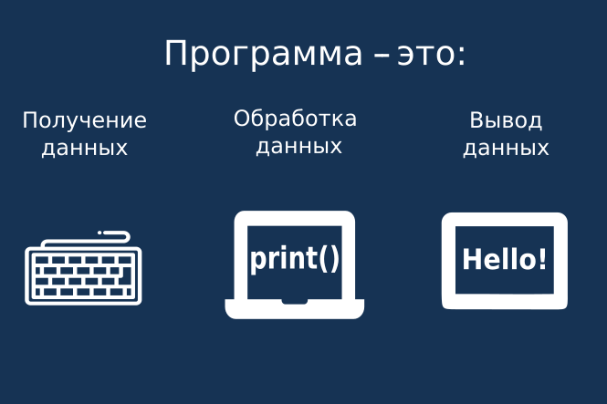  

Наша игра работает так:  
**1. Получение данных:** когда мы вводим код в редактор кода справа.  
**2. Обработка данных:** когда мы нажимаем на кнопку «Проверить» и алгоритм проверяет правильность введенного кода.  
**3. Вывод данных:** когда в окне «Результаты» видим сообщение о результате. 

#### Вывод данных. Функция print

Для вывода информации в Python есть встроенная функция `print`.
Синтаксис `print` несложный. Для вывода информации наберите в редакторе Python:

```python
print("Hi there!")
```
в ответ вы увидите строку: `Hi there!`.  

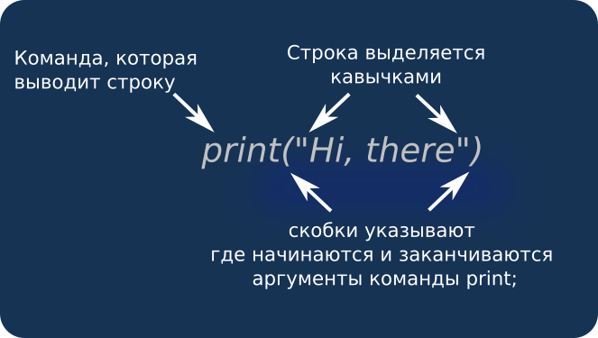

## Основная особенность Python


Чем точно отличается Python от других языков программирования и что вы нигде больше не встретите?  

#### Пробел важен! 

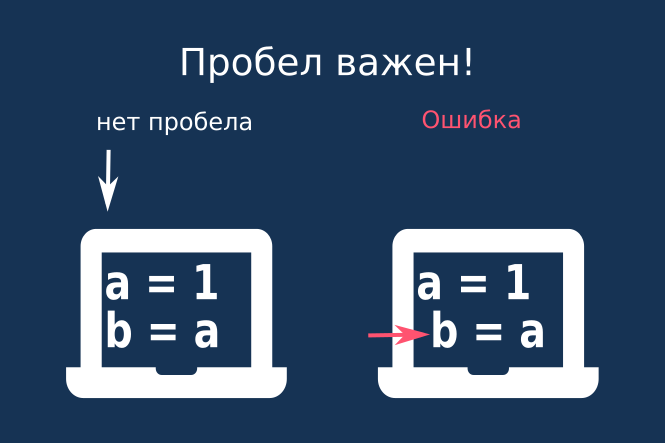  

#### Первая строка

Пробелы в Python используются для выделения подчиненности &mdash; если оператор имеет отступ от края больший, чем у предыдущей 
строки &mdash; значит он **является подчиненным к ней**.  

Первая команда не является подчиненной ни для какой другой и не должна иметь отступ от края, т.е. первым символом 
в строке, не может быть пробел, а должен быть символ команды.

#### Следующие строки

Если во второй строке (или в любой другой) будет размещен дополнительный пробел,
тогда интерпретатор будет выдавать ошибку.  
Выполнение программы:

```python
a = 4
    b = 5
c = 6
```

вызовет такую ошибку:

```
  File "c:\work\python\examples\spaces.py", line 2
    b = 5
    ^
IndentationError: unexpected indent
```

<div class="attention">
  <h5>Внимание</h5>
  <p>`Unexpected indent` - неожиданный отступ.</p>
  <p>При дальнейшей работе с Python обращайте внимание на пробелы!</p>
</div>


<h3 class="task">Задание</h3>

Уберите лишние пробелы перед командой `print("Hello, World. I have startup!")`.

## Строки

Работа с текстовыми данными в Python реализована через строки.  

**Строка** &mdash; это неизменная последовательность символов. 

Для того, чтобы создать переменную типа "строка", необходимо определенный набор символов заключить в кавычки.

* Вариант 1. Одинарные кавычки (апостроф) `'some text'`.
* Вариант 2. Двойные кавычки `"some text"`.

Различные варианты использования кавычек обусловлены, в том числе тем,
что при использовании одинарных кавычек, можно в строке указать двойные и наоборот. 
 
Очень важно, чтобы открывающие и закрывающие кавычки совпадали: 

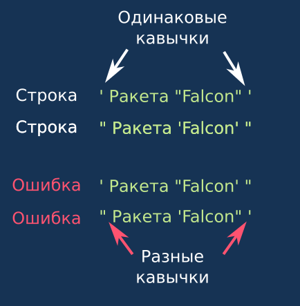  

```python
game_string = 'My "Game"'
```

Основной операцией, которую можно произвести над строками, является операция их объединения (конкатенация).
То есть можно получить значение строки, как результат объединения двух других.

```python
str1 = 'Elon'
str2 = 'Musk'
result = str1 + ' ' + str2
print(result)
```

*Данная программа выведет строку `'Elon Musk'`*   

Обратите внимание, что в строке `result = str1 + ' ' + str2` между апострофами `' '` есть пробел.

<h3 class="task">Задание</h3>

Создайте строку `startuper_string` так, чтобы в строке `hello_world` содержалось: `Hello, World. I have startup!`.
## Числовые переменные в Python


**Переменная** &mdash; это способ обратиться к данным по имени. Переменная нужна для того, чтобы сохранять промежуточный или конечный результат работы программы.
  
Например &mdash; итоговую стоимость всех товаров в корзине Интернет-магазина будем хранить в переменной **cart**, при этом в самом начале покупок &mdash; она будет иметь значение `0`. При добавлении первого товара стоимостью `100` &mdash; значение переменной **cart** увеличится на `100`.

```python
cart = 0
cart = cart + 100
```

Чтобы переменная получила новое значение, необходимо записать в одной строке её **имя**, **оператор присваивания** и **значение**, которое мы хотим передать этой переменной.

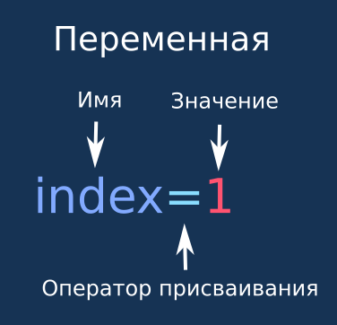  

#### Типы переменных  
Каждая переменная имеет определенный тип данных. От типа переменной зависит то, какие действия можно с ней совершать.  
Для работы со строками применяются переменные типа `str` (с ними мы познакомились в прошлом задании), для работы с числами используются типы `int` (целые числа) и `float` (числа с плавающей запятой).

#### Числовые типы переменных Python

* Numbers &mdash; любые числовые данные.
    * Int &mdash; целые числа.
         ```python
         int_value = 1
         ```
    * Float &mdash; числа с плавающей точкой (вещественные числа).
         ```python
         float_value = 1.0
         ```

Если значение переменной можно представить как тип `int` без потерь значения, то этот тип и будет использован.
Если же есть дробная часть отделенная точкой &mdash; будет использован тип `float`.

Интерпретатор Python автоматически выбирает тип во время присвоения значения (первого или повторного) &mdash; такое свойство интерпретатора называется *динамическая типизация*  

</details>

<h3 class="task">Задание</h3>
<div class="useful">
<p>Вы стартапер и для запуска Вам не хватает только денег. Вы можете продать долю вашего стартапа одному инвестору (у Вас останется 50%), а если двоим &mdash; 33,33%.
</p>
</div>

Создайте переменные с названиями:  `my_int`, `my_float` и задайте им значения 50 и 33.33 соответственно. 

## Логический тип переменных в Python


Переменные логического типа данных могут принимать только два варианта: `True` (Истина) и `False` (Ложь).  

Например, у покупателя в магазине есть только 3000. Если товар ему подходит и стоит меньше 3000, то он его купит.
```python
price1 = 4590
price2 = 2590

print(price1<3000) #выведет False
print(price2<3000) #выведет True
```

#### Комментарии
Часто в тексте программы пишутся комментарии, которые поясняют то, что делают те или иные команды. Текст после символа `#` и до конца текущей строки становится невидимым для интерпретатора.  
В предыдущей задаче и далее комментарии в примерах кода будут пояснять работу программы.

#### Операторы сравнения

Значения логического типа являются результатами работы операторов сравнения:

```python
a = 2
b = 3
c = a > b
print("Выражение a > b имеет значение")
print(c) #выведет False
```
Самые часто используемые операторы сравнения:  
* Больше `>`  
* Меньше `<`  
* Равно `==`  

<div class="interesting">
<h5>Обратите внимание!</h5>
<p>Оператор сравнения &mdash; это двойное равно (`==`), в то время, как одинарное равно (`=`) &mdash; это оператор присваивания.</p>
</div>

  
Магазин одежды, запустил акцию "Без сдачи" и дарит подарок всем покупателям, которые дают сумму равную стоимости товара.

```python
price = 5634
cash = 5634
bonus = (price == cash) #Значение переменной bonus станет равно True
```

```python
price = 3420
cash = 5634
bonus = (price == cash) #Значение переменной bonus станет равно False
```

Т.е. в случае, если значение переменной `price` равно значению переменной `cash`, выражение `price == cash` возвращает результат `True`, который можно присвоить переменной `bonus`.

ъ
<h3 class="task">Задание</h3>
<div class="useful">

Вы решили искать одного инвестора и с 10-го раза нашли. Инвестор просит оценить Вас стоимость половины компании. Пропишите 3 варианта:  
1. Впишите любую цифру, которая меньше запланированных инвестором 100000 так, чтобы сделка состоялась. 
2. Впишите любую цифру, которая БОЛЬШЕ запланированных инвестором 100000. Cделка срывается вообще. 
3. Вы просите инвестора самого оценить компанию, он называет 100000 и сделка успешна.

P.S. Старайтесь всегда не называть сумму первыми, а просите назвать инвесторов. По крайней мере Вы узнаете мнение об оценке компании от нескольких более опытных людей, не будете казаться сумасшедшим мечтателем или не будете винить себя, что мало назвали)
</div>


1. Инвестор определился, что инвестирует не более определенного лимита (`price_limit1`). Укажите значение цены половины Вашего стартапа (`price1`), так чтобы сделка по её продаже состоялась.
2. Инвестор определился, что не потратит на покупку половины Вашего стартапа более чем `100000` (`price_limit2`), а вы определили стоимость половины Вашего стартапа в размере `150000` (`price2`). Допишите выражение так, чтобы переменная `decision2` получила значение `false`.
3. Вы просите инвестора самому оценить стоимость половины Вашего стартапа (`wanted_price`), и в любом случае соглашаетесь с этой ценой (ваша цена `price`), т.к. для вас очень важно, чтобы сделка состоялась . Допишите выражение так, чтобы переменная `guaranteed_deal` получала значение `True`, если Вы получили за 50% доли в Вашем стартапе ту сумму, которую назвал инвестор.

## Оператор контроля выполнения


Для того, чтобы выполнять часть команд только при определенном условии, в Python реализован оператор контроля выполнения (условный оператор) `if`.

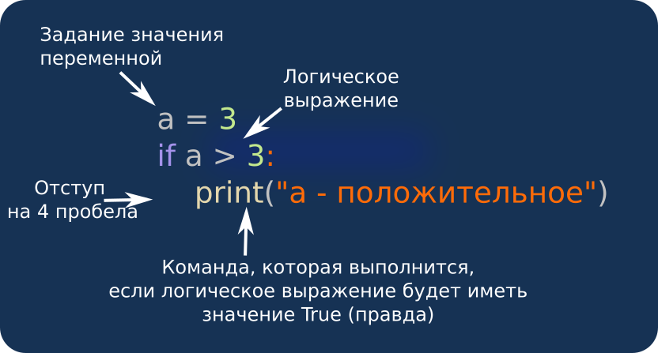

Обязательным элементом оператора контроля выполнения является **логическое выражение** &mdash; выражение результатом выполнения которого будет значение `True` или `False`. 
 
Самое простое логическое выражение состоит из оператора сравнения и двух **операндов**, которые могут быть числами или числовыми переменными.  

**Операторы сравнения:**

|Оператор сравнения|Логическое выражение|Результат|
|:---|:---:|:---:|
|`<` (меньше)| 2 < 2| False |
|`<=` (меньше или равно)| 2 <= 2 | True|
|`>` (больше)| 2 > 2| False|
|`==` (равно)| 2 == 2| True|
|`!=` (не равно)| 2 != 2| False|

**Пример использования оператора контроля выполнения.**  
  В своем стратапе вы приняли решение разделить всех разработчиков на две категории &mdash; junior-программисты (получают меньше 1000 долларов) и все остальные (получают 1000 долларов и больше).

```python
rate = 2700

if rate<1000:
    qualification = 'junior'
if rate>=1000:
    qualification = 'middle&senior'

print(qualification) #выведет middle&senior
```
</details>

<h3 class="task">Задание</h3>
<div class="useful">
К вам обратился ваш знакомый Жора, который в школе был умным парнем. Он очень красиво рассказывал какой он крутой разработчик. Вы спросили за сколько он готов работать? Жора сказал, что будет работать над проектом за 800 долларов. Определите уровень Жоры как разработчика. 
</div>

1. Задайте логическое выражение в первом операторе `if` так, чтобы оно описывало, что junior-разработчики получают меньше 1000 долларов.
2. Задайте размер зарплаты Жоры (`rate`), чтобы он относился к junior-разработчикам.

## Оператор контроля выполнения и логические операторы


Несколько логических выражений можно связывать между собой с помощью **логических операторов** И (`and`), ИЛИ (`or`).

Разделим разработчиков, которые работают в вашем стартапе не на 2 категории, а на 3: `junior`, `middle`, `senior`.
Junior-специалисты зарабатывают меньше 1000 долларов, middle-разработчики от 1000 до 2700 и senior-разработчики &mdash; больше 2700 долларов в месяц.

```python
rate = 2700

if rate<1000:
    qualification = 'junior'
if rate>=1000 and rate<=2700:
    qualification = 'middle'
if rate>2700:
    qualification = 'senior'

print(qualification) #Вернет 'middle'
```

Обратите внимание, что для того, чтобы определить получает ли разработчик зарплату middle-уровня нужно объединить 2 условия: `rate>=1000` и `rate<=2700`

</details>

<h3 class="task">Задание</h3>
<div class="useful">
На конференции вы услышали, что в паре с одним джуном стартап не запустить. Вы обратились к другому более опытному другу Пете и он сказал, что будет работать с Вами за 1800 долларов. Вы опять не понимаете кто такой Петя: джун или сеньор? 
</div>

1. Определите уровень навыков Пети: 
* junior-разработчики получают меньше `1000` долларов, 
* middle-разработчики &mdash; от `1000` до `2200` долларов, 
* senior-разработчики &mdash; более `2200` долларов в месяц. 

2. Переменной `rate` присвойте значение уровня оплаты Пети (1800). 

## Практическая задача.

<h3 class="task">Задание</h3>
   

1. Создайте три переменные: `name`, `rate`, `my_qualification`. 
2. В переменную `name` внесите своё имя.
3. В переменную `rate` внесите заработок.
4. В переменную `my_qualification` внесите квалификацию в соответствии с зарплатой (значение переменной `rate`) согласно следующей зарплатной политике:  
   * **junior** &mdash; меньше `1000` долларов, 
   * **middle** &mdash; от `1000` до `2200` долларов,
   * **senior** более `2200` долларов в месяц. 
5. Реализуйте необходимое количество операторов `if`, в результате которых переменная `qualification` получит значение в соответствии со значением переменной `rate` и описанной в зарплатной политике (п.4.).  
   
В результате выполнения задания (если вы бы ввели имя `Max` и квалификацию `junior`) должна сформироваться строка `My name is Max! I am junior developer`.

## Циклы

<details open>
  <summary>Теория</summary>

**Циклы** &mdash; это управляющие конструкции, которые позволяют выполнять набор команд несколько раз.  
**Тело цикла** &mdash; набор команд, которые повторяются при выполнении цикла.  
### Цикл for. Список чисел

Перед вами лестница в 5 ступенек. Вы идете по ступенькам, до того как поднялись на первую &mdash; посчитали `0`, а затем &mdash; `1,2,3,4,5`.  
```python
for i in range(6):
    print(i)# Выведет в столбик 0 1 2 3 4 5
```
`i` &mdash; **счетчик цикла**, на каждом шаге цикла получает следующее значение из интервала, который идет после оператора `in`  
`range(6)` &mdash; перечислимый объект, в данном случае диапазон чисел (range) от 0 до 6 (не включая 6) `(0 1 2 3 4 5)`  
&nbsp;&nbsp;&nbsp;&nbsp;`print(i)` &mdash; тело цикла, данная команда будет повторяться на каждом шаге цикла. При этом значение переменной `i` в теле цикле изменяется на каждом шаге цикла.

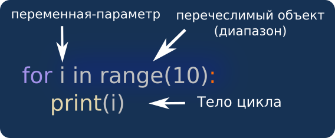

#### Сумма цифр

Сумма &mdash; это очень распространенная операция: вы считаете купюры или будете суммировать зарплаты, которые нужно выплатить разработчикам в проекте.
 
В электронных таблицах можно объединить ячейки и нажать кнопку суммы, но для программиста необходимо знать, что происходит, когда нажимается кнопка суммы.  

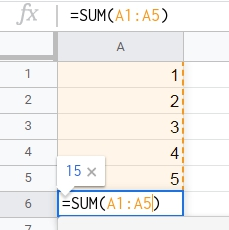


Представьте, что у вас есть листочки, на которых написано 0, 1, 2, 3, 4. И вы их по очереди кладете в шкатулку.  
Значение переменной `sum` будет соответствовать сумме чисел, которые написаны на листочках находящихся в шкатулке.
```python
sum = 0
for i in range(5):
    sum=sum+i # i будет последовательно принимать значения 0 1 2 3 4
print(sum) #выведет 10 (10 = 0+1+2+3+4)
```
Данная программа получает сумму всех элементов, которые получает переменная `i` в процессе выполнения цикла.  
`sum` &mdash; это переменная-накопитель, в которой "накапливается" значение переменной `i`.

|Шаг цикла|Действие|Значение i| Значение sum|
|---|:---:|:---:|:---:|:---:|
|-|sum = 0|-|0|
|1|sum = sum + i|0|0|
|2|sum = sum + i|1|1|
|3|sum = sum + i|2|3|
|4|sum = sum + i|3|6|
|5|sum = sum + i|4|10|

</details>

<h3 class="task">Задание</h3>
<div class="useful">
Вы решили, что вашего технического уровня недостаточно и решили найти технического наставника. Им стал Саша, который работает в крупной аутсорсинговой компании. Саша указал на то, что Вы слабо разбираетесь в теме циклов.
</div>

Допишите управляющую конструкцию цикла так, чтобы после его выполнения в `sum` находилась сумма цифр от `0` до `10` включительно.


## Цикл for. Вывод значений в одну строку.

<details open>
  <summary>Теория</summary>

#### Цикл for. Числа в строки

Если в цикле запустить команду `print`, то он будет выводить числа в столбик.

```python
for i in range(6):
    print(i)# Выведет в столбик 0 1 2 3 4 5
```
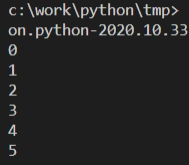  

Такой формат объясняется тем, что функция `print` при каждом вызове выводит текст с новой строки.
Для того, чтобы вывести данные в ряд &mdash; нам необходимо составить из чисел строку.

```python
string = ''
for i in range(6): 
    string = string + str(i)

print(string) #Выведет 012345
```

Функция `str(i)` &mdash; получает число, а возвращает строку.  

Чтобы "разделить" эти элементы, нужно после каждого элемента **добавить пробел** (`' '`).

```python
string = '' #между апострофами нет пробела
for i in range(6): 
    string = string + str(i) + '  ' #между апострофами - есть пробел

print(string) #Выведет 0 1 2 3 4 5 

```
На каждом следующем шаге цикла переменной `string` присваивается объединение трёх строковых значений: `string` + `str(i)` + `' '` (значение переменной `string` на предыдущем шаге, `str(i)` - значение переменной `i` приведенное к строке, `' '` - пробел).

### Приведение типов
В программе выше нам необходимо было из целочисленного значения переменной получить строку. Для того, чтобы объединить с другой строкой.  
Операция получения значения одного типа переменных из другого называется **приведением типов**:

|Конечный тип|Исходное значение|функция приведения|конечное значение|
|---|:---:|:---:|:---:|
|Строка (str)|1|str(1)|'1'|
|Целое число (int)|'12'|int('12')|12|
|Вещественное число (float)|1|float(1)|1.0|


</details>

<h3 class="task">Задание</h3>
<div class="useful">
 На втором занятии с Сашей-программистом вы разобрали тему приведения типов. При этом Саша опирался на тему прошлого занятия по циклам. И вы на себе ощутили, что важно указывать связь с предыдущими действиями для формирования единого понимания темы.
</div>

Присвойте переменной `string` строку `0 1 2 3 4 5 6 7 8 9 10 ` (после числа 10, как и после остальных, идет пробел).

## Списки — встроенные контейнеры Python

<details open>
  <summary>Теория</summary>

В повседневной жизни мы очень часто используем списки &mdash; от покупок и приглашенных на день рождения, до значений роста учеников в классе.  
В Python существует структура данных, которая позволяет работать с определенными наборами данных &mdash; "список".

#### Списки

**Списки в Python** — это упорядоченные индексированные переменные-контейнеры для хранения любых типов данных.   
  
Списки подобны массивам в Java, но могут содержать элементы различных типов.

Чтобы создать список с элементами 1,2,3,4,5, есть 2 способа:

```python
#Первый способ: объявляем список со значением
my_list1 = [1,2,3,4,5]
print(my_list1)#[1,2,3,4,5]
#Второй способ: объявляем пустой список и методом append по очереди добавляем все элементы
my_list2 = []
my_list2.append(1)
my_list2.append(2)
my_list2.append(3)
my_list2.append(4)
my_list2.append(5)
print(my_list2)#[1,2,3,4,5]
```

Список можно представить как ящик, в котором есть несколько ячеек с номерами. Нумерация в списке начинается с нуля.  
Теперь "достанем" значение нулевой и первой ячейки

```python
my_list1 = [1,2,3,4,5]
print(my_list[0])#выведет 1
print(my_list[1])#выведет 2
```
Количество ячеек в ящике (элементов списка) в процессе работы программы может меняться. Чтобы узнать текущую длину списка используется функция `len`.

```python
my_list = [1,2,3,4,5]
print(len(my_list))#5
```
Функция `len` &mdash; получает список и возвращает количество элементов в нем.

</details>

<h3 class="task">Задание</h3>
<div class="useful">
Вы не только доучиваете технические термины, но и успели собрать целую команду.  
В неё вошли Вы, 2 Python и 2 Front-end-разработчика.   
Уровень зарплат членов вашей команды теперь: 600, 800, 1800, 2500, 3300.   
Вы решили фиксировать зарплаты в отдельном документе: внесли в него суммы зарплат и посчитали количество членов в вашей команде.
</div>

1. Создайте список `rate_list` и заполните его числами `600`, `800`, `1800`, `2500`, `3300`.
2. Переменной `developer_number` присвойте значение длины созданного вами списка `rate_list` таким образом узнайте кол-во человек в вашей команде.

## Циклы. Список строк

<details open>
  <summary>Теория</summary>

#### Список строк

Работу цикла `for` можно сравнить с тем, что вы по очереди берете фрукты из корзины
и проговариваете название взятого фрукта.

```python
fruits = ['apple', 'pear', 'apricot', 'orange', 'plum']
for fruit in fruits:
    print(fruit)# Выведет 'apple', 'pear', 'apricot', 'orange', 'plum'
```

В Python, цикл `for` используется для обработки списков и других *итерируемых* (перечислимых) объектов.
Операторы, которые находятся в теле цикла, будут выполнены столько раз, сколько элементов в списке.  

При этом, на каждом шагу специальная переменная (идет между ключевыми словами `for` и `in`) получает значение одного из элементов списка.

#### Сбор строки

Напомним, что если на каждом шагу цикла делать вывод в консоль командой (`print`), получится вывод в столбик. Но так не удобно просматривать информацию которая выводится. С помощью цикла можно элементы списка вывести в строку:

```python
slogan = ['небо', 'море', 'облака']
out = ''
for elem in slogan:
    out = out + elem
print(out)#небомореоблака
```

Без задания значения нельзя использовать переменную в выражениях. Поэтому, чтобы на первом шагу цикла выражение `out + elem` не вызвало ошибку неопределенного значения переменной `out`, перед выполнением цикла ей присваивается значение пустой строки (`out = ''`).  

В предыдущем примере программа соединила все строки-элементы списка в одну строку.  

Для того, чтобы такое соединение было читабельным, необходимо добавить пробелы:  

```python
slogan = ['небо', 'море', 'облака']
out = ''
for elem in slogan:
    out = out + elem
    out = out + ' '
print(out)#небо море облака
```

</details>

<h3 class="task">Задание</h3>
<div class = "useful">
Вы воодушевлены &mdash; вы теперь команда. Даже создали общий чат в телеграмме, заказали одинаковые кружки и сгенерировали логотип.    
</div>


Допишите управляющую конструкцию цикла так, чтобы в результате его выполнения переменная `string` имела значение `We are team` (объединение значений элементов списка `slogan`, с добавлением пробелов между ними).

## Цикл for. Работа со списком

<details open>
  <summary>Теория</summary>

**Циклы** &mdash; это управляющие конструкции,
которые позволяют выполнять набор команд (тело цикла) несколько раз.


#### Вычисления суммы элементов списка

У вас в стартапе работает 5 разработчиков с окладом соответственно 1300, 1200, 2800, 3800, 4800.  

```python
developer_rates = [1300, 1200, 2800, 3800, 4800]

sum = 0
for rate in developer_rates:
    sum += rate
print(sum)#Выведет 13900
```

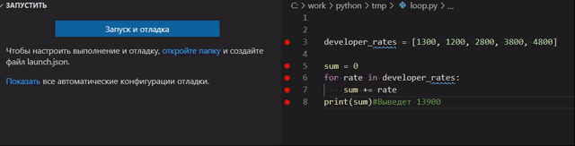

</details>

<h3 class="task">Задание</h3>

<div class = "useful"> В конце месяца вам нужно посчитать сумму зарплат на всю команду.  
Если считать на калькуляторе, то сначала Вы вводите свои 600 (и получаете суммарно пока 600), потом зарплату Жоры 800 (получаете сумму 1400), потом 1800 Пети (3200), затем фронтендщиков Аню со ставкой 2500 (суммарно 5700) и Макса 3300 (теперь сумму выдаст 9000).  
  
Чтобы повторить тему "Циклы", Вы решили написать скрипт на Python, который будет считать зарплату за вас.
</div>

Допишите управляющую конструкцию цикла так, чтобы после его выполнения переменная `sum` получала значение суммы всех элементов списка `developer_rates`.  

Для счетчика цикла используйте переменную `developer_rate`.

## Циклы

<details open>
  <summary>Теория</summary>

Цикл `for` на практике используется для формирования новых списков на основе уже существующих. 
 
Например, вы решили каждые 3 дня с начала месяца  делать бек-ап сервера. Для этого, из списка дней месяца вы составляете список дней, в которые главный сервер будет создавать резервную копию всех данных.

```python
a = [1, 2, 3, 4, 5, 6, 7, 8, 9, 10, 11, 12, 13, 14, 15, 16, 17, 18, 19, 20, 21, 22, 23, 24, 25, 26, 27, 28, 29, 30]
result = []
for elem in a:
    if not elem % 3:
       result.append(elem)

print(result)   # Выведет [3, 6, 9, 12, 15, 18, 21, 24, 27, 30]
```

Определение кратности обеспечивается за счет оператора `%` ("остаток от деления").
То есть, если остаток от деления числа на `3` равен нулю, то такое число кратно `3`.

Также важной особенностью является то, что `0` соответствует логическому значению `False`, то есть выражение
`a % 3 == 0` и `not a % 3` будут эквивалентными.

В примере,  мы из элементов одного списка составили другой список с помощью метода `append`.

</details>

<h3 class="task">Задание</h3>
<div class  = "useful">
Инвестор сказал, что 9000 долларов для вашей команды и проекта &mdash; это много. Настоятельно рекомендует снизить до 5000 долларов фонд на зарплату.  
Вы не хотите никого увольнять, поэтому предлагаете всем перейти на половину ставки. Все предупреждают, что в таком случае они будут первую половину дня работать в других компаниях. Вы просите работать на выходных тоже и потом соглашаетесь.  
Теперь Вы будете собираться с командой на 15-минутный звонок 1 раз в 2 дня. Допишите цикл так, чтобы определить четные дни месяца для звонков команды.  
</div>

Допишите программу, которая из списка дней в месяце будет создавать список четных дней: `[2, 4, 6, 8, 10, 12, 14, 16, 18, 20, 22, 24, 26, 28, 30]`.
Для списка четных дней используйте переменную `result`.


## Условия в циклах

<details open>
  <summary>Теория</summary>

В ИТ-компании происходит анализ затрат на оплату труда. Общий размер фонда оплаты труда разработчиков: 

```python
developer_rates = [600, 800, 1800, 2500, 3300]

total_rate=0
for rate in developer_rates:
    total_rate+=rate

print(total_rate)# Вернет 9000
```

Одним из актуальных вопросов является сумма заработной платы Senior-разработчиков. В вашем стартапе Senior-разработчики получат более 2200 долларов в месяц.

```python
developer_rates = [600, 800, 1800, 2500, 3300]

total_seniors=0
for rate in developer_rates:
    if rate > 2200:
        total_seniors+=rate

print(total_seniors)# 5800
```

####  Логический оператор `not`

Продолжая анализировать заработную плату разработчиков, инвестора заинтересовала сумма зарплат не Senior-разработчиков.

```python
developer_rates = [600, 800, 1800, 2500, 3300]
total_not_seniors = 0

for rate in developer_rates:
    if not rate > 2200:
        total_not_seniors += rate

print(total_not_seniors)# 3200
```

Для решения данной задачи применен логический оператор `not`. Eго основная задача &mdash; изменять логические выражения на обратные, т.е. если логическое выражение имеет значение `True` и перед ним поставить оператор `not`, в результате получим `False`

</details>

<h3 class="task">Задание</h3>
<div class = "useful">
Вы уже месяц пилите свой стартап, первый раз выплатили зарплаты, но результата пока нет. Инвестор спрашивает: "Много ли у вас джунов в команде и сколько на них уходит?"  
</div>

Присвойте переменной `total_juniors` значение суммы зарплат всех junior-разработчиков, если известно, что их уровень оплаты труда менее `1000` долларов в месяц.


## Списки. Функция минимума и максимума.

<details open>
  <summary>Теория</summary>

#### Списки

Представьте, что у нас есть зарплаты 5 программистов и мы хотим узнать максимальную зарплату и минимальную зарплату.  

```python
rates = [1300, 1200, 2800, 3800, 4800]  # список целых чисел
min_rate = min(rates) # сохраняем наименьшее число из списка в min_rate 
max_rate = max(rates) # сохраняем наибольшее число из списка в max_rate 
print(min_rate) # выведет 1200
print(max_rate) # выведет 4800
```

Для решения этой задачи мы использовали **список** из 5 числовых значений. 
 
**Список** &mdash; это последовательность значений любого типа. 

Список мы обработали функциями `min` и `max`, которые вычисляют минимальное и максимальное значение списка соответственно.

</details>

<h3 class="task">Задание</h3>

<div class = "useful"> Каждый член команды на стендапе говорит о проделанной работе, проблемы не называются. У каждого локально на его компьютере код запускается, но вместе собрать не выходит. Продукт не получается. Настроение не очень. Вам стало интересно: кто самый высокооплачиваемый и низкооплачиваемый разработчики?   
</div>


1. Сохраните наименьшее число из списка `developer_rates` в `min_rate`.
2. Сохраните наибольшее число из списка `developer_rates` в `max_rate`.


## Расчет статистики

<details open>
  <summary>Теория</summary>

**Статистика** &mdash; это важный раздел математики. Инструменты статистики позволяют получить значение для принятия решений на основе большого количества данных. 
Со статистикой мы сталкиваемся в повседневной жизни, например, когда выбираем самого высокого ученика в классе и ставим его на 1 место в колонне (применяем функцию `max` для параметра роста), или же когда рассчитываем средний балл аттестата (применяем функцию `mean` для перечня со всеми оценками за предметы в аттестате).

**Python** &mdash; это язык программирования, который специализируется на работе с данными. Самые распространенные математические функции реализованы в его ядре (в отличие от, например, `JavaScript`, где все статистические функции можно использовать только через объект `Math`).

Например, наибольшее или наименьшее значение из списка можно получить с помощью встроенных в ядро функций `max` и `min` соответственно.

Для того, чтобы определить количество элементов, которое содержится в нашей статистической выборке, можно воспользоваться встроенной
функцией `len`, а для того, чтобы удобно вычислять сумму элементов списка существует функция `sum`
```Python
numbers = [1, 2, 3, 4, 10]

print(min(numbers)) # Выведет 1
print(max(numbers)) # Выведет 10
print(len(numbers)) # Выведет 5
print(sum(numbers)) # Выведет 20
```

Но не всегда хватает возможностей функций ядра. Например, важным значением является среднее значение (отношение суммы к количеству).

```Python
numbers = [1,2,3,4,10]
print(sum(numbers)/len(numbers)) # Выведет 4
```
Как видно из примера, для вычисления среднего нам нужно вызвать две функции ядра, и взять отношение одной ко второй.
</details>

<h3 class="task">Задание</h3>
<div class = "useful">
Вы решаете уволить самого высокооплачиваемого разработчика Макса. Теперь фонд оплаты труда меньше на 3300 долларов в месяц. Инвестор услышал о таком решении и ему становится тревожно. Он просит отчет. Посчитайте сколько у вас осталось человек в команде, какая теперь средняя зарплата, какая общая зарплата.  
</div>

1. Запишите в переменную `mean` среднее значение из `rates`.
2. Запишите в переменную `item_number` количество элементов в `rates`.
3. Запишите в переменную `total` сумму всех элементов `rates`.

## Словари

<details open>
  <summary>Теория</summary>

**Словарь** &mdash; это переменная-контейнер, в которой неупорядоченно хранятся пары ключ-значение.

Например, мы знаем, что минимальная зарплата в команде разработчиков `1200` долларов в месяц, максимальная - `4800`, средняя - `2780`, в команде `5` человек и общий фонд оплаты труда `13900`. В виде словаря это может быть записано следующим образом:

```python{
dev_rates_stat = {
        "mean": 2780
        "min" : 1200, 
        "max": 4800, 
        "item_number": 5, 
        "total_rate" : 13900
}

```

При объявлении словаря мы можем не только задать числа, но и внести формулы вычисления этих значений.

```python
dev_rates = [1300, 1200, 2800, 3800, 4800]
dev_rates_stat = {
        "mean": statistics.mean(dev_rates), 
        "min" : min(dev_rates), 
        "max": max(dev_rates), 
        "item_number": len(dev_rates), 
        "total_rate" : sum(dev_rates)
}

print(dev_rates_stat)#{'mean': 2780, 'min': 1200, 'max': 4800, 'item_number': 5, 'total_rate': 13900}
```

Также, элементы словаря можно изменять в процессе работы с ним.

```python
dev_rates_stat={"mean":None,"min":None,"max":None,"item_number":0,"total":0} #Вы определили те показатели, которые будете считать

developer_rates = [1300, 1200]#появились первые сотрудники

#Внесли расчетные данные
dev_rates_stat["mean"] = statistics.mean(developer_rates)    
dev_rates_stat["min"] = min(developer_rates)   
dev_rates_stat["max"] = max(developer_rates)   
dev_rates_stat["item_number"] = len(developer_rates)   
dev_rates_stat["total"] = sum(developer_rates)    

print(dev_rates_stat)#{'mean': 1250, 'min': 1200, 'max': 1300, 'item_number': 2, 'total': 2500}
```

</details>

<h3 class="task">Задание</h3>
<div class = 'useful'>
Вы очень много времени тратите на отчеты и расчеты. Поэтому решили написать скрипт, который поможет стандартизировать отчетность и сам будет считать зарплаты команде.  Вы решили включить в этот отчет миинимальный и максимальный размер зарплаты, количество сотрудников и общий фонд оплаты труда. 
</div>

1. В словарь `stat` по ключу `min` внесите минимальное значение заработной платы разработчиков из списка `rates`.
2. В словарь `stat` по ключу `max` внесите максимальное значение заработной платы разработчиков из списка `rates`.
3. В словарь `stat` по ключу `item_number` внесите количество разработчиков из списка `rates`.
4. В словарь `stat` по ключу `total` внесите общий размер фонда заработной платы разработчиков из списка `rates`.


## Словари

<details open>
  <summary>Теория</summary>

**Словарь** &mdash; это переменная-контейнер, в которой неупорядоченно хранятся пары ключ-значение.

В кадровой службе компании есть карточка каждого сотрудника, в этой карточке указано: имя, город, квалификация, телефон, размер оплаты.

```python
developer = {'Name': 'Vlad',  'City': 'Lviv', 'Skill': 'Python', 'Rate': 2700, 'Phone': '+3806312345678'}  
```

В данном примере ключу `'Name'` соответствует значение `'Vlad'`, ключу `'City'` &mdash; значение `'Lviv'` и т.д.

#### Получение значения словаря по ключу

У кадровой службы есть карточка сотрудника (которая программно реализована в формате словаря). И директор по кадрам хочет увидеть информацию о сотруднике.

Для того, чтобы получить значение словаря, необходимо обратиться к нему, указав соответствующий ключ в квадратных скобках.

```python
developer = {'Name': 'Vlad',  'City': 'Lviv', 'Skill': 'Python', 'Rate': 2700, 'Phone': '+3806312345678'}
print(developer['Name'])          # Вернет 'Vlad' 
print(developer['City'])     # Вернет 'Lviv'
print(developer['Skill'])           # Вернет 'Python'
print(developer['Rate'])           # Вернет 2700
print(developer['Phone'])           # Вернет '+3806312345678'
```

</details>

<h3 class="task">Задание</h3>
<div class = "useful">
Вы пилите продукт уже 4-й месяц. Инвестор просит продемонстрировать результаты. Вам нечего показать. Инвестор просит показать документацию к проекту. У Вас нет документации. Инвестор замораживает проект. Вы распускаете команду. Но 1 разработчик Петя не унимается, работает ночами самостоятельно и собирает первую версию для демо инвестору.  
  
Вы с Петей показываете продукт инвестору и просите инвестора увеличить Пете зарплату в 2 раза. Инвестор спрашивает вас о том, сколько Петя получал до этого.  
</div>

1. Переменной `name` присвойте значение элемента словаря `developer` с ключем `Name`.
2. Переменной `rate` присвойте значение элемента словаря `developer` с ключем `Rate`.


## Словари. Список словарей

<details open>
  <summary>Теория</summary>

В итоговом проекте мы будем работать со списком из 2000 записей, среди которых вам нужно будет выбрать вашу команду.
Но для того, чтобы разработать саму функцию мы будем работать со списком нашей команды, в которой 4 Python-разработчика и 1 FrontEnd-разработчик. 

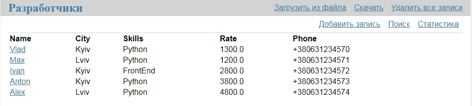  

Для того, чтобы начать работать с данными, нам необходимо их передать в программу. Наши 5 записей &mdash; это список словарей.

```python
developer1={'Name':'Vlad','City':'Kyiv','Skill':'Python','Rate':1300,
'Phone':'+380631234570'}
developer2={'Name':'Max','City':'Lviv','Skill':'Python','Rate':1200,
'Phone':'+380631234571'}
developer3={'Name':'Ivan','City':'Kyiv','Skill':'FrontEnd','Rate':2800,
'Phone':'+380631234572'}
developer4={'Name':'Anton','City':'Kyiv','Skill':'Python','Rate':3800,
'Phone':'+380631234673'}
developer5={'Name':'Alex','City':'Lviv','Skill':'Python','Rate':4800,
'Phone':'+380631234574'}

developers = [developer1,developer2,developer3,developer4,developer5]
```

Названия столбцов нашей итоговой таблицы &mdash; это ключи словарей, а номера строк &mdash; это номера элементов списка.

Например, мы хотим узнать уровень зарплаты 3 по счету программиста.

```python
developer1={'Name':'Vlad','City':'Kyiv','Skill':'Python','Rate':1300,
'Phone':'+380631234570'}
developer2={'Name':'Max','City':'Lviv','Skill':'Python','Rate':1200,
'Phone':'+380631234571'}
developer3={'Name':'Ivan','City':'Kyiv','Skill':'FrontEnd','Rate':2800,
'Phone':'+380631234572'}
developer4={'Name':'Anton','City':'Kyiv','Skill':'Python','Rate':3800,
'Phone':'+380631234673'}
developer5={'Name':'Alex','City':'Lviv','Skill':'Python','Rate':4800,
'Phone':'+380631234574'}

developers = [developer1,developer2,developer3,developer4,developer5]

rate_3 = developers[2]["Rate"]
print(rate_3)#2800
```

Получается, что при такой структуре (список словарей) мы можем получить любое значение. Для этого нужно указать номер строки (начиная с `0`) и свойство, которое нам необходимо в этой строке.  
С помощью такой структуры мы, можем производить вычисления. Например, посчитать сумму зарплат junior-разработчиков (уровень оплаты ниже `1400`)

```python
developer1={'Name':'Vlad','City':'Kyiv','Skill':'Python','Rate':1300,
'Phone':'+380631234570'}
developer2={'Name':'Max','City':'Lviv','Skill':'Python','Rate':1200,
'Phone':'+380631234571'}
developer3={'Name':'Ivan','City':'Kyiv','Skill':'FrontEnd','Rate':2800,
'Phone':'+380631234572'}
developer4={'Name':'Anton','City':'Kyiv','Skill':'Python','Rate':3800,
'Phone':'+380631234673'}
developer5={'Name':'Alex','City':'Lviv','Skill':'Python','Rate':4800,
'Phone':'+380631234574'}

developers = [developer1,developer2,developer3,developer4,developer5]

sum_1_2 = developers[0]["Rate"]+developers[1]["Rate"]
print(sum_1_2)#2500
```

</details>

<h3 class="task">Задание</h3>
<div class = "useful">
Инвестору понравилась сырая версия. Он снова верит в ваш продукт и решает инвестировать не только деньгами, но и предлагает подключить своих людей с более сильными навыками. Это называется "Smart Money".  
Инвестор передает вам свою записную книжку и рекомендует пригласить в команду 5 лучших разработчиков. Вы им звоните, но соглашаются только первый, третий и пятый фуллстек-разработчики из его записной книжки.
Вам нужно посчитать сколько будет стоить сотрудничество с ними.  
</div>

1. В переменную `sum_1_3_5` присвойте сумму заработных плат `1`, `3` и `5` разработчика (помните, что у людей список начинается с `1`, а в программировании - с `0`).
2. В переменную `tel_5` присвойте значение номера телефона `5`-го разработчика. 

## Функции

<details open>
  <summary>Теория</summary>

**Функция** &mdash; это фрагмент кода, к которому можно обратиться из другой части программы.  
Функции похожи на программы &mdash; они получают данные, обрабатывают их и возвращают результат, но для запуска функции нужно обратиться к ней по имени в тексте основной программы.

<div class="useful">
<h5>Пример использования функций</h5>
<p>Для Интернет-магазина очень часто нужно, зная код товара получать все данные о нем: в основном каталоге, в избранном, в корзине..., т.е. много раз использовать один и тот же код. Используя функцию, мы напишем такой код только 1 раз и далее &mdash; просто будем его вызывать в нужном месте программы.</p>
</div>

#### Создание пользовательских функций

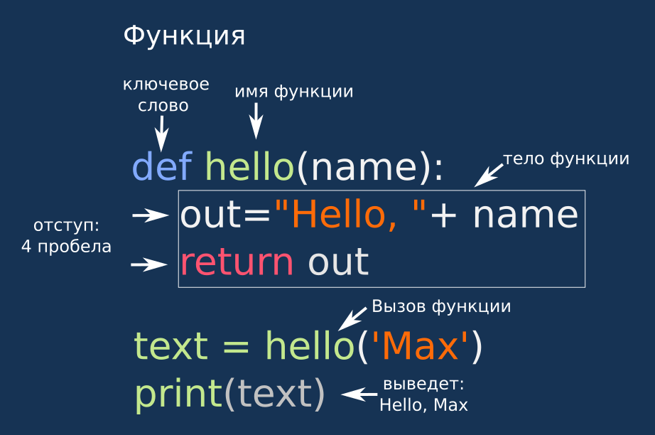  

```python
def hello():
    print("Hello world")
    print("Hello Hello!")

hello() #Выведет "Hello world" на первой строке и "Hello Hello! - на второй
```

#### Передача параметров в функцию
Для функций существует возможность получать параметры и использовать их при выполнении команд в теле функции.
Перечень параметров должен быть размещен в скобках после названия функции.

```python
def plus(a, b):
    print(a+b)

plus(5, 7) # Выведет 12
```

#### Возврат результата

Функция в Python может не только выполнять команды, но возвращать значение.
Для возврата значения необходимо его указать после ключевого слова `return` в конце тела функции.  

Например, функция, выполняющая операцию сложения.
```python
def plus(a, b):
  c = a + b
  return c
  
res = plus(3, 4)
print(res) # Выведет 7
```

</details>

<h3 class="task">Задание</h3>
<div class = "useful">
Инвестор спрашивает о том, сколько будет суммарно уходить на зарплату для Вас и Пети, а также 3 новых разработчиков. Также инвестор просит посчитать разницу между старым и новым размером зарплатного фонда.  
</div>

1. Доработайте функцию `plus`, чтобы она возвращала сумму полученных параметров (зарплаты старой и новой команды).
2. Доработайте функцию `minus`, чтобы она возвращала разность полученных параметров (зарплаты новой и старой команды).  
Обратите внимание, что зарплата новой команды больше чем старой, а результат должен быть положительным.

## Функции

<details open>
  <summary>Теория</summary>

**Функция** &mdash; это мини-программа, которую можно запустить в любом месте основной программы.  
  
Функции позволяют написать один раз набор команд, а использовать его десятки и сотни раз в разных местах программы.

#### Список словарей.
В позапрошлом задании мы научились работать со списком словарей, обращаясь к его элементам:
```python
developer1={'Name':'Vlad','City':'Kyiv','Skill':'Python','Rate':1300,
'Phone':'+380631234570'}
developer2={'Name':'Max','City':'Lviv','Skill':'Python','Rate':1200,
'Phone':'+380631234571'}
developer3={'Name':'Ivan','City':'Kyiv','Skill':'FrontEnd','Rate':2800,
'Phone':'+380631234572'}
developer4={'Name':'Anton','City':'Kyiv','Skill':'Python','Rate':3800,
'Phone':'+380631234673'}
developer5={'Name':'Alex','City':'Lviv','Skill':'Python','Rate':4800,
'Phone':'+380631234574'}

developers = [developer1,developer2,developer3,developer4,developer5]

sum_1_2 = developers[0]["Rate"]+developers[1]["Rate"]
print(sum_1_2)#2500
```
Для последующих вычислений нам необходимо из общего списка словарей выделить список значений зарплат разработчиков.
```python
developer1={'Name':'Vlad','City':'Kyiv','Skill':'Python','Rate':1300,
'Phone':'+380631234570'}
developer2={'Name':'Max','City':'Lviv','Skill':'Python','Rate':1200,
'Phone':'+380631234571'}
developer3={'Name':'Ivan','City':'Kyiv','Skill':'FrontEnd','Rate':2800,
'Phone':'+380631234572'}
developer4={'Name':'Anton','City':'Kyiv','Skill':'Python','Rate':3800,
'Phone':'+380631234673'}
developer5={'Name':'Alex','City':'Lviv','Skill':'Python','Rate':4800,
'Phone':'+380631234574'}

developers = [developer1,developer2,developer3,developer4,developer5]

rates = []
for dev in developers:
    rates.append(dev["Rate"])

print(rates) #[1300, 1200, 2800, 3800, 4800]
```
#### Функции. Список словарей.
Мы уже научились работать со списком словарей и доставать из него список значений зарплат разработчиков.  
Для того, чтобы такое действие можно было выполнять в разных местах программы напишем функцию, которая будет получать в качестве параметра список словарей.

```python
developer1={'Name':'Vlad',"City":"Kyiv","Skill":"Python","Rate":1300,
'Phone':'+380631234570'}
developer2={'Name':'Max',"City":"Lviv","Skill":"Python","Rate":1200,
'Phone':'+380631234571'}
developer3={'Name':'Ivan',"City":"Kyiv","Skill":"Python","Rate":2800,
'Phone':'+380631234572'}
developer4={'Name':'Anton',"City":"Kyiv","Skill":"Python","Rate":3800,
'Phone':'+380631234573'}
developer5={'Name':'Alex',"City":"Lviv","Skill":"Python","Rate":4800,
'Phone':'+380631234574'}

developers_list = [developer1,developer2,developer3,developer4,developer5]

def get_rates(developers):
    rates = []
    for developer in developers:
        rates.append(developer["Rate"])
    return rates

print(get_rates(developers_list)) #[1300, 1200, 2800, 3800, 4800]

```


</details>

<h3 class="task">Задание</h3>
<div class = "useful">
Пришло время выплачивать зарплату новой команды. Вы планировали использовать для рассчетов уже написанную вами программу.  
Но, потому что вы пожадничали денег на приватный репозитарий и не заливали ранее её на GitHub, долго её искали у себя на компьютере, а когда нашли &mdash; жесткий диск на вашем компьютере вышел из строя. Из этого Вы сделали вывод, что все программы нужно заливать на GitHub.  
А после восстановления работоспособности компьютера &mdash; написали ещё одну программу для учета заработной платы. 

</div>

1. Укажите для словаря `developer1` свои имя (значение по ключу `Name`) и город (значение по ключу `City`).
2. Допишите функцию `get_rates`, которая получает список словарей c информацией о разработчиках и возвращает список их зарплат.

## Функции. Передача списка словарей как параметра функции

<details open>
  <summary>Теория</summary>

В этой задаче мы подведем итог сегодняшнего дня: мы создадим функцию `get_rate_stat`, которая используется в финальном проекте для вывода статистики.
  
Такая функция будет получать значение списка разработчиков, производить вычисления и возвращать словарь, в котором собраны все статистические показатели

#### Получение списка из списка словарей

```python
import statistics
dev1={'Name':'Vlad',"City":"Kyiv","Skill":"Python","Rate":1300,
'phone':'+3806312345670' }
dev2={'Name':'Max',"City":"Lviv","Skill":"Python","Rate":1200,
'phone':'+3806312345671'  }
dev3={'Name':'Ivan',"City":"Kyiv","Skill":"Python","Rate":2800,
'phone':'+3806312345672' }
dev4={'Name':'Anton',"City":"Kyiv","Skill":"Python","Rate":3800,
'phone':'+3806312345673'}
dev5={'Name':'Alex',"City":"Lviv","Skill":"Python","Rate":4800,
'phone':'+3806312345674' }

devs = [dev1,dev2,dev3,dev4,dev5]

def get_rate_stat(developers):
    rates = []
    stat = {"mean": None, "min": None, "max": None, "item_number": 0}
    
    for developer in developers:
        rate = developer['Rate']
        rates.append(rate)
    
    if rates:
        stat.update(
            {
                "mean": statistics.mean(rates),
                "min": min(rates),
                "max": max(rates),
                "item_number": len(rates)
            }
        )
    return stat

print(get_rate_stat(devs))#{'mean': 2780, 'min': 1200, 'max': 4800, 'item_number': 5}
```

</details>

<h3 class="task">Задание</h3>
<div class = "useful">
Петя устал смотреть как Вы постоянно считаете отчеты и за ночь сам написал первую работающую версию систему HR-учета людей в команде, чтоб вы больше не отвлекались. Вы показали ее инвестору, инвестор сказал, чтоб вы бросали прошлый проект и начинали писать эту систему учета, а он ее купит и будет использовать в своих бизнесах.  
</div>

1. Укажите для словаря `developer1` свои имя (значение по ключу `Name`) и город (значение по ключу `City`).

2. Подкорректируйте функцию `get_rate_stat` так, чтобы словарь `stat`, который она возвращает получал такие значения: 
* по ключу `'mean'` &mdash; среднее значение элементов списка  `rates`
* по ключу `'min'` &mdash; минимальное значение среди элементов списка  `rates`
* по ключу `'max'` &mdash; максимальное значение среди элементов списка  `rates`
* по ключу `'item_number'` &mdash; количество элементов в списке  `rates`