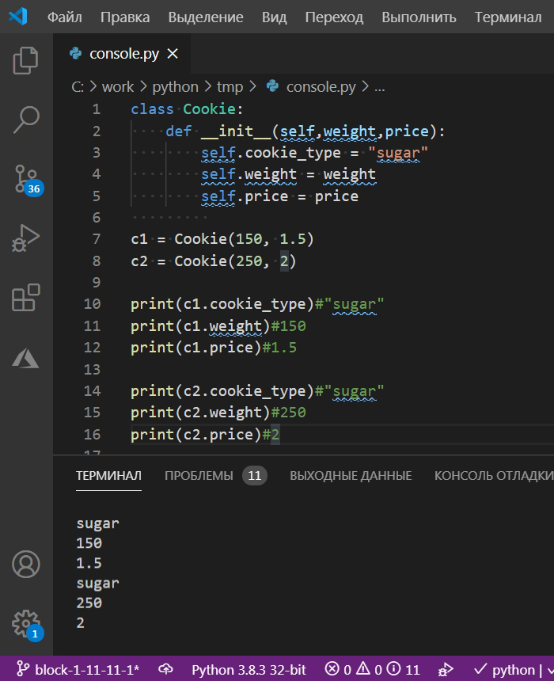
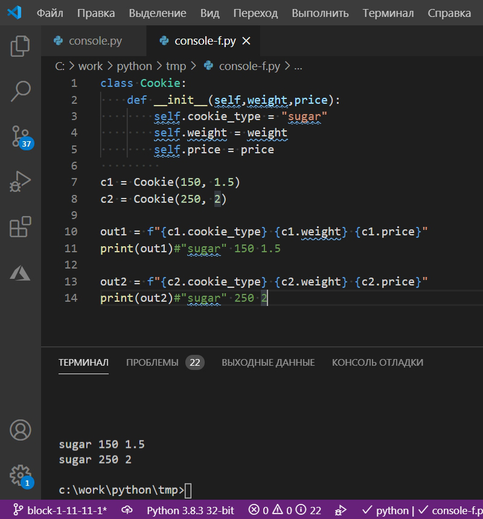
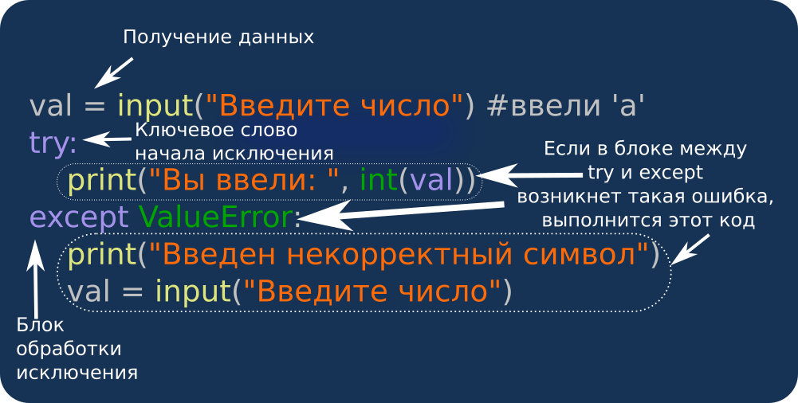
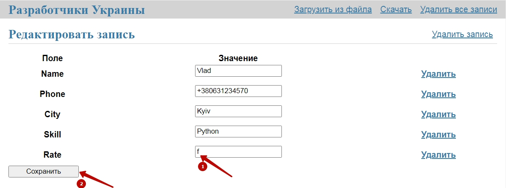
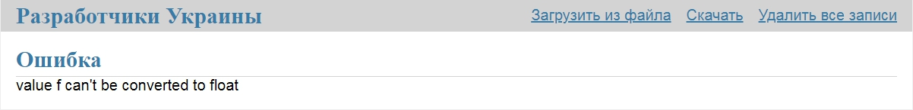

## Классы и объекты

<details open>
  <summary>Теория</summary>

Для того, чтобы документы не терялись - их объединяют в папки по смыслу, которые ставят на полки. А для того, чтобы не терялись переменные и функции их объединяют в специальные структуры - **классы**.

В предыдущем дне мы писали программы на функции, списки, строки, которые описывают информацию о разработчике.  В этом дне мы объединим практически весь этот функционал в классе `Developer`, который будет описывать "функционал" нашего разработчика.  А также научимся создавать `объекты` на основе созданного класса `Developer`.
Класс опишет всё, что можно узнать о программисте, а объекты, созданные на его основе будут хранить и обрабатывать эту информацию. 

Использование объектов и классов позволяет сделать код программы более структурированным и связным, что значительно снижает затраты времени на написание программы и поддержки её работоспособности.

**Классы** &mdash; это шаблон для создания объектов.  
**Объект** &mdash; это переменная, созданная на основе класса.

По общепринятым правилам название класса пишется с большой буквы, а название объекта &mdash; с маленькой.

Класс и объект связаны как форма для выпечки печенья и само печенье: из одной формы можно испечь много-много печенюшек.  

Например, создадим форму для выпечки песочного печенья весом 200 грамм.

```python
class Cookie:
    cookie_type = "sugar"#сахарные печенья (поле cookie_type)
    weight = 200 #весом 200 грамм (поле weight)
```

Переменные внутри класса называются **поля класса**.

</details>

<h3 class="task">Задание</h3>
<div class = "useful">
В статье Вы прочитали, что перед началом разработки любого продукта, нужно сначала установить проблему, которую продукт будет решать. Необходимо поговорить с пользователями, провести интервью, а потом уже пилить решение. Это называется CustDev.
Чтобы повторно не начинать разработку никому не нужного продукта, Вы решаете сначала уточнить у инвестора: зачем ему вообще ваша система? 
     
Инвестор сказал, что мечтает привязать показатели активности и уровень технических навыков  разработчиков к размеру заработной платы и бонусов. Второй проблемой инвестор назвал невозможность быстро посчитать соотношение затрат на зарплату отдельных команд разработчиков и полученных результатов их деятельности.  
  

Вы сразу делаете себе заметку, что раз разработчиков в вашей системе будет много и они однотипны, то лучше использовать классы, а не создавать каждого разработчика с нуля.

</div>
Создайте класс `Developer`, который описывает программиста (`skill` имеет значение `"Python"`) и уровень его оплаты (`rate` имеет значение `1100`).


## Классы и объекты

<details open>
  <summary>Теория</summary>

*Напомним:*  
**Класс** &mdash; это шаблон для создания объектов.  
**Поля класса** &mdash; это переменные внутри класса.  
  
В прошлом задании мы сделали форму для выпечки печенья:

```python
class Cookie:
    cookie_type = "sugar"#сахарные печенья (поле cookie_type)
    weight = 200 #весом 200 грамм (поле weight)
```

Испечем 3 печенья с помощью нашей формы.

```python
class Cookie:
    cookie_type = "sugar"#сахарные печенья (поле cookie_type)
    weight = 200 #весом 200 грамм (поле weight)

c1 = Cookie()#первое печенье
c2 = Cookie()#второе печенье
c3 = Cookie()#третье печенье
```

Вызов класса `Cookie()` &mdash; создает объект соответствующего класса. Команда `c1 = Cookie()` присваивает переменной `c1` значение созданного объекта.  
Результатом выполнения примера выше будет создание `c1`,`c2`,`c3` &mdash; объектов метода `Cookie`, которые описывают три разные печенюшки, созданных с помощью формы `Cookie()`.

</details>

<h3 class="task">Задание</h3>
<div class = "useful">
Ваш инвестор, который выступает в роли заказчика, заработал состояние на продаже сладостей. Поэтому для простоты уточнения IT-терминов вы решили проводить аналогии с печеньем.
</div>
Создайте 3 объекта класса `Developer`: `developer1`, `developer2`, `developer3`.


## Классы и объекты

<details open>
  <summary>Теория</summary>

*Напомним:*  
**Класс** &mdash; это шаблон для создания объектов.  
**Поля класса** &mdash; это переменные внутри класса.  
**Объект** &mdash; это экземпляр (результат выполнения) класса. 

В прошлом задании мы сделали форму для выпечки печенья и "испекли" 3 печенюшки:

```python
class Cookie:
    cookie_type = "sugar"#сахарные печенья (поле cookie_type)
    weight = 200 #весом 200 грамм (поле weight)

c1 = Cookie()#первое печенье
c2 = Cookie()#второе печенье
c3 = Cookie()#третье печенье
```

Но после того, как печенья испекли, главный кондитер захотел продегустировать их: откусил половинку первого печенья (его вес стал 100 грамм). После этого все три печенья положили на весы и взвесили.

```python
class Cookie:
    cookie_type = "sugar"#сахарные печенья (поле cookie_type)
    weight = 200 #весом 200 грамм (поле weight)

c1 = Cookie()#первое печенье
c2 = Cookie()#второе печенье
c3 = Cookie()#третье печенье

с1.weight = 100

total_weight = c1.weight + c2.weight + c3.weight
print(total_weight)#500
```

В данной программе мы описали класс `Cookie`, создали объекты `c1, c2, c3`, используя команды `c1 = Cookie()`, `c2 = Cookie()`, `c3 = Cookie()`.
Разберем подробнее команду `c1 = Cookie()`.
В процессе её выполнения происходит несколько действий:
1. `Cookie()` &mdash; создает в оперативной памяти компьютера объект класса `Cookie`.
2. Оператор присваивания `=` связывает переменную `c1` с той областью памяти, где был создан объект класса `Cookie`.

При этом, при создании объекта, происходит 2 процесса:
* выделение памяти (нужно выделить память под поля `cookie_type` и `weight`) &mdash; непосредственно создание объекта;
* присвоение значений по-умолчанию &mdash; инициализация объекта.

Эти два процесса связаны друг с другом, поэтому можно сказать, что в результате команды `c1 = Cookie()` происходит создание объекта `c1` и его инициализация.

</details>

<h3 class="task">Задание</h3>
<div class = "useful">
Вы дочитали статью о Custdev до конца и оказалось, что между заказчиком и пользователем есть большая разница. Не всегда тот, кто платит, выступает пользователем продукта. Поэтому вы идете к бухгалтеру Соне и спрашиваете с какими проблемами она сталкивается в работе по начислению заработной платы. Соня с нескрываемой завистью говорит, что программистам каждые полгода увеличивают зарплаты и все общие затраты приходится пересчитывать.  

Вы решаете реализовать функционал легкого пересчета общего фонда на зарплату после ее повышения у кого-то из программистов. 
</div>
Поднимите первому программисту (`developer1`) зарплату до уровня `1300` долларов и переменной `total_rate` присвойте значение фонда оплаты труда трех программистов.

## Создание объекта. Методы класса

<details open>
  <summary>Теория</summary>

*Повторим:*

**Класс** &mdash; это шаблон для создания объектов.  
**Поля класса** &mdash; это переменные внутри класса.  
**Объект** &mdash; это экземпляр (результат выполнения) класса. 

#### Создание объекта. Метод \_\_init\_\_

Создание объекта &mdash; это очень важное событие. Технически, во время создания объекта выделяется область памяти под все поля, которые определены классом объекта, а также в эту область памяти размещаются "значения по-умолчанию". В прошлых заданиях мы пекли сахарное печенье с помощью такого формата задания класса:

```python
class Cookie:
    cookie_type = "sugar"
    weight = 200 
```

Но возможности такого формата задания класса очень ограничены - мы можем печь только сахарные печенья весом в 200 грамм. В следующем примере мы сделаем то же самое, но уже используя специальный инструмент, который в дальнейшем позволит нам удобно управлять процессом выпечки печенья.

```python
class Cookie:
    def __init__(self):
        self.cookie_type = "sugar"
        self.weight = 200 

c1 = Cookie()

print(c1.cookie_type)#"sugar"
print(c1.weight)#200
```

В данной программе появилась новая структура &mdash; метод.

**Метод** &mdash; это функция внутри класса.  

Через параметр `self`, который всегда стоит на первом месте в списке параметров, метод связывается с полями данного класса.
Инструкция `self.cookie_type = "sugar"` означает, что значение `"sugar"` присваивается полю *текущего* класса.

</details>

<h3 class="task">Задание</h3>
<div class = "useful">
Дальше вы идете к финансовому директору Анастасии. Анастасия рассказывает,  что 2 года назад компания столкнулась с проблемами в оплате труда разработчиков. Не было политики определения  размера зарплат и новые программисты постоянно получали сразу больше старых. Поэтому она героически ввела грейдинг и теперь существует единая политика начисления зарплаты, исходя из навыков программистов.  
  
Вы отмечаете, что и в этом случае, техническая реализация будет легче через классы.
</div>
  
Написать метод `__init__` так, чтобы все экземпляры класса `Developer` при инициализации получали поле `skill` со значением `'Python'` и поле `rate` со значением `1000`.


## Передача параметров в метод \_\_init\_\_

<details open>
  <summary>Теория</summary>

*Повторим:*

* **Класс** &mdash; это шаблон для создания объектов.  
* **Поля класса** &mdash; это переменные внутри класса.  
* **Объект** &mdash; это экземпляр (результат выполнения) класса.  
* **Метод класса** &mdash; это функция внутри класса.  

В прошлом задании мы разобрали то, как с помощью метода `__init__` в классе мы создавали значения по-умолчанию в объекте.

```python
class Cookie:
    def __init__(self):
        self.cookie_type = "sugar"
        self.weight = 200 

c1 = Cookie()

print(c1.cookie_type)#"sugar"
print(c1.weight)#200
```

Обычно, только часть параметров можно задать "по-умолчанию", остальные будут для каждого объекта уникальными.
Например, при выпечке, тип печенья определяется рецептом, а вот вес и цена могут быть разными для каждой печенюшки. Испечем 2 печенья: первое весом `150` грамм и выставим его на продажу в кондитерской за `1.5` доллара, второе &mdash; весом `250` грамм и выставим его на продажу за `2 `доллара.


```python
class Cookie:
    def __init__(self,weight,price):
        self.cookie_type = "sugar"
        self.weight = weight
        self.price = price
         
c1 = Cookie(150, 1.5)
c2 = Cookie(250, 2)
```

Обратите внимание:
* в строке объявления метода 3 параметра `def __init__(self,weight,price):` (`self`,`weight`,`price`), 
* а при вызове метода ему передается только 2 параметра `c1 = Cookie(150, 1.5)` (`150`, `1.5`).  

Согласно архитектуры языка программирования Python, первый параметр (`self`) любого метода **ВСЕГДА** получает значение текущего объекта и используется для обращения к его полям.

</details>

<h3 class="task">Задание</h3>
<div class = "useful">
Вы довольны подходом Custdev и идете дальше. Просите о созвоне линейного бухгалтера Александра, который работает в одном из небольших филиалов компании в городе Зеро. Александр рассказывает, что в мире существует несправедливость и он четко видит, что разработчики из филиала Зеро получают меньше тех, кто сидит в больших городах. Также Александр рассказывает, что начислять зарплату, не зная номер телефона сотрудника, &mdash; это самая большая проблема в жизни бухгатлера небольшого филиала.  
  
Вы решаете добавить поля "город" и "номер телефона" в класс разработчиков.
</div>
Допишите метод `__init__` так, чтобы:
* при создании все экземпляры класса `Developer` получали значения по-умолчанию для полей `city` (`'Kyiv'`),`skill` (`'Python'`) и `rate` (`1300`), а также 
* значения полей `name` и `phone` задаются при создании объекта.


## Вывод значений полей класса в консоль. F-строки

<details open>
  <summary>Теория</summary>

В прошлой задаче мы создавали объекты `c1` и `c2` класса `Cookie` со значением по умолчанию `self.cookie_type = "sugar"` и передаваемыми значениями `weight` и `price`.

```python
class Cookie:
    def __init__(self,weight,price):
        self.cookie_type = "sugar"
        self.weight = weight
        self.price = price
         
c1 = Cookie(150, 1.5)
c2 = Cookie(250, 2)
```

Для контроля процесса выпечки печенья, показатели каждого изделия выводятся на специальное табло, на котором указаны тип печенья, вес и цена для каждого кондитерского изделия.

```python
class Cookie:
    def __init__(self,weight,price):
        self.cookie_type = "sugar"
        self.weight = weight
        self.price = price
         
c1 = Cookie(150, 1.5)
c2 = Cookie(250, 2)

print(c1.cookie_type)#"sugar"
print(c1.weight)#150
print(c1.price)#1.5

print(c2.cookie_type)#"sugar"
print(c2.weight)#250
print(c2.price)#2
```

В программировании инструментом вывода требуемых значений выступает консоль. Консоль &mdash; это специальная область, в которую выводятся значения. Вывод в консоль осуществляется командой `print`
  

на изображении указана программа и результат её выполнения к консоли в редакторе кода `VSCode`.  
Но, как мы видим, команда `print` каждое новое значение выводит на новой строке. Из-за этого на одном экране мы можем увидеть данные только по 2-м объектам (обычно высота консоли 6-7 строк)

### F-строки

Для форматирования вывода в `Python` используется инструмент F-строк. Он позволяет выводить несколько значений переменных в одну строку.

```python
class Cookie:
    def __init__(self,weight,price):
        self.cookie_type = "sugar"
        self.weight = weight
        self.price = price
         
c1 = Cookie(150, 1.5)
c2 = Cookie(250, 2)

out1 = f"{c1.cookie_type} {c1.weight} {c1.price}"
print(out1)#"sugar" 150 1.5

out2 = f"{c2.cookie_type} {c2.weight} {c2.price}"
print(out2)#"sugar" 250 2
```

  

Использование `f-строк` позволяет делать вывод в консоль лаконичным и более читабельным.

</details>

<h3 class="task">Задание</h3>

Задать значение переменной `out`, которое позволит вывести в консоль значения всех полей объекта `developer` в формате `'Vlad Kyiv Python 1300 +380631234570'`.

## Метод \_\_str\_\_

<details open>
  <summary>Теория</summary>

В прошлом задании мы создали класс, который получает значения, но чтобы вывести его значения в консоль нам пришлось перечислить все его поля в команде `print`. 

```python
class Cookie:
    def __init__(self,weight,price):
        self.cookie_type = "sugar"
        self.weight = weight
        self.price = price

c1 = Cookie(150, 1.5)
c2 = Cookie(250, 2)

out1 = f"{c1.cookie_type} {c1.weight} {c1.price}"
print(out1)#"sugar" 150 1.5

out2 = f"{c2.cookie_type} {c2.weight} {c2.price}"
print(out2)#"sugar" 250 2
```

#### Вывод значений объекта в строку

В практике программирования это не удобно. Для того, чтобы создать возможность получать значения объекта в удобном виде, используется метод `__str__`. С его помощью создается вывод и тогда объект можно вызывать по имени.

```python
class Cookie:
    def __init__(self,weight,price):
        self.cookie_type = "sugar"
        self.weight = weight
        self.price = price

    def __str__(self):
        return f"{self.cookie_type} {self.weight} {self.price}"

c1 = Cookie(150, 1.5)
print(c1)#sugar 150 1.5
```

</details>

<h3 class="task">Задание</h3>

Дописать метод `__str__`, класса `Developer`, который позволит выводить информацию из объекта в формате `'Vlad' 'Kyiv' 'Python' 1300 '+380631234570'`.


## Задание списка, как значения поля

<details open>
  <summary>Теория</summary>

Для работы с данными используются всего 4 основных действия: 
* создание;
* чтение;
* обновление;
* удаление. 

В теории программирования используется удобная англоязычная аббревиатура для запоминания этих действий: CRUD (Create, Read, Update, Delete).  
  
Все эти действия определены для списков в Python. В первый день марафона мы уже знакомились с этой структурой. В этом и следующих заданиях мы будем использовать списки, как поле класса, и создавать методы, которые реализуют концепцию CRUD.  

Вспомним встроенные методы списков в `Python`:
* Создание (добавление) элемента &mdash; метод `list.append('new element 1')`.
* Чтение элемента &mdash; обращение по номеру элемента `print(list[0])`.
* Обновление (изменение элемента) &mdash; обращение по номеру и присвоение значения `list[0] = 'new element 2'`.
* Удаление элемента &mdash; метод `list.pop(0)`.

#### CREATE - Добавление элемента. Метод `append`

От простой выпечки печенья мы перешли к мелкосерийной кулинарной выпечке. Для того, чтобы контролировать процесс выпечки, мы планируем вести учет. И выделили параметры, которые будем учитывать: тип выпечки, вес, цена, энергетическая ценность.

```python
class Cookie:
    def __init__(self):
        self.params = []

c1 = Cookie()

c1.params.append('cookie_type')
c1.params.append('weight')
c1.params.append('price')
c1.params.append('energy')
```

Мы создали класс `Cookie`, который при создании получает поле `params`, которое равно пустому списку.  
Далее - добавили элементы `'cookie_type'`, `'weight'`, `'price'`, `'energy'` к полю `c1.params` с помощью метода `append`.

#### Изменение элемента. UPDATE

В ходе обсуждения проекта создания системы учета принято решение значение параметра `'cookie_type'` заменить на `'type'`.

```python
class Cookie:
    def __init__(self):
        self.params = []

c1 = Cookie()

c1.params.append('cookie_type')
c1.params.append('weight')
c1.params.append('price')
c1.params.append('energy')

c1.params[0] = 'type'
```

В данной программе мы обратились к 0-му элементу списка, который хранится в поле `params` объекта `c1`.

#### Удаление. DELETE

При разработке системы учета печенья решили сделать отдельную укороченную версию, в которой останется только 2 первых параметра (`'cookie_type'` и `'weight'`).

```python
class Cookie:
    def __init__(self):
        self.params = []

c1 = Cookie()

c1.params.append('cookie_type')
c1.params.append('weight')
c1.params.append('price')
c1.params.append('energy')

c1.params[0] = 'type'

c1.params.pop(3)
c1.params.pop(2)

out = f"{c1.params[0]} {c1.params[1]}" # type weight
print(out)
```
</details>

<h3 class="task">Задание</h3>

1. Создайте класс `Developer` с методом `__init__`, который задает пустой список значению полю `self.fields`
2. Создайте объект `developer` класса `Developer`
3. Добавьте 5 значений полю `fields` созданного объекта `developer` (`'name'`,`'city'`,`'developer_skill'`,`'rate'`,`'phone'`)
4. Измените значение элемента `'developer_skill'` списка `fields` на `'skill'`
5. Удалите 2 последних элемента списка `fields`
6. Присвойте переменной `out` первые три значения списка `fields` через пробел в формате `name city skill` (рекомендуется использовать функционал f-строк)


## Поиск элемента списка в поле класса

<details open>
  <summary>Теория</summary>

В прошлом задании мы создали поле `params` в классе `Cookie`. При создании объекта класса `Cookie` поле `params` получало значение пустого списка, что позволило нам поработать со списком: добавлять, удалять, обновлять и читать его элементы.

```python
class Cookie:
    def __init__(self):
        self.params = []
```

В этой задаче мы реализуем поиск по всем полям нашего класса `Cookie`.
Переопределим магический метод `__contains__`, который отвечает за реализацию оператора `in` для объектов класса `Cookie`. 

Оператор `in` проверяет содержится ли значение левого операнда в правом операнде (возвращает `True`, если содержится и `False` в противном случае)

|Выражение|Результат|
|---|---|
|'a' in 'Hello'|False|
|'o' in 'Hello'|True|
|1 in [1,2,3]|True|
|5 in [1,2,3]|False|

В `self.params` содержатся объекты, которые наследуют класс `Cookie`, а в классе `Cookie`
реализован метод `__contains__` и для того, чтобы проверить входит ли `item` в `self.params`
достаточно выполнить операцию:

```python
class Cookie:
    def __init__(self):
        self.params = []

    def __contains__(self, item: str):
        for param in self.params:
            if item in param:
                return True
        return False

c1 = Cookie()

c1.params.append("sugar")
c1.params.append("price")
c1.params.append("weight")
c1.params.append("energy")

print("energy" in c1)#True
print("palm_oil" in c1)#False
```

В  методе `__contains__` мы с помощью цикла `for (for param in self.params:)` поочередно сравниваем каждый элемент списка
`self.params` со значением параметра `item`. Если хотя бы одно совпадение происходит, то возвращаем значение `True`
`(return True)`, если совпадений не обнаружено, цикл завершается и отрабатывается команда `return False`.

</details>

<h3 class="task">Задание</h3>

Допишите элементы метода `__contains__`, который должен проверить, содержит ли хоть один элемент
списка `self.fields` значение `item`.


## Добавление элемента в список в методе.

<details open>
  <summary>Теория</summary>

Напомним:
**Список** &mdash; это переменная, которая содержит несколько значений.  
```python
    class Cookie:
        def __init__(self):
            self.fields = []
```

Задавать значение списка можно по элементам. Это похоже на очередь. Первый в очереди занимает позицию `0`, второй - `1` и т.д.

```python
fields = [] # Пустой список
fields.append("name") #['name']
fields.append("city") #['name','city']
fields.append("rate") #['name','city','rate']
```

Метод `append` можно использовать, передавая ему переменную. В этом случае в список будет добавляться её значение.

#### Добавление элемента списка

```python
class Cookie:
    def __init__(self):
        self.params = []

    def add(self, param_item):
        self.params.append(param_item)
```

</details>

<h3 class="task">Задание</h3>

Доработайте метод `add` класса `Developer` так, чтобы он добавлял переданный параметр `field_item`
в конец списка `self.fields`.

## Удаление элемента списка из поля класса

<details open>
  <summary>Теория</summary>

Напомним, что список - очень похож на очередь людей, в которой каждый имеет свой порядковый номер. Нумерация &mdash; начинается с 0.  
```python
    def add(self, param):
        self.params.append(param)

c1 = Cookie()

c1.add('cookie_type')
c1.add('weight')
c1.add('price')
c1.add('energy')

print(c1.params)# ['cookie_type', 'weight', 'price', 'energy']
```
Представьте себе, что 2-й участник очереди, решил что больше не будет стоять и ушел... Т.е. на 2-е место в очереди стал тот, кто стоял на 3-м месте, на 3-е место стал тот, кто стоял на 4-м и так далее до конца очереди.  

При удалении элемента списка его номер можно передавать через значение переменной:

```python
fields = ['one','two','three','four']
idx = 1 #2-й по счету элемент в списке имеет номер 1
fields.pop(idx) #будет удален тот элемент, номер которого соответствует значению переменной idx
print(fields)  # ['one','three','four']
```

#### Удаление элемента списка в поле

Реализуем удаление элемента списка в поле `self.params` по номеру

```python
class Cookie:
    def __init__(self):
        self.params = []
    
    def delete(self, idx):
        self.params.pop(idx)
```

</details>

<h3 class="task">Задание</h3>

Доработайте метод `delete` класса `Developer` так, чтобы он удалял элемент с индексом `idx`
из списка записей, который хранится в поле `fields`.


## Изменение значений списка в поле класса

<details open>
  <summary>Теория</summary>

С любой записью, в бумажном журнале или в компьютерной программе, можно сделать только 3 действия: добавить, удалить и изменить.

Перейдем к созданию метода `update` для обновления значения поля.

#### Изменение значений списка

Представьте себе ситуацию, мы собираем после семинара информацию о программистах. И в форме обратной связи есть место только для 3-х полей, которые заполнят участники семинара о себе. При этом изначально планировали собирать: имя, телефон и город. Но, в итоге, было принято решение город заменить на ставку:

```python
# Создание списка со значениями
fields = ['name','phone','city']
fields[2] = 'rate'#Заменим 3-й элемент списка на 'rate'
print(field)  # Вернет ['name','phone','rate']
```

<div class="attention">
  <h5>Внимание</h5>
  <p>Первый элемент в спискe имеет индекс - <code>0</code>.</p>
</div>

Реализуем изменение значений списка `params` в классе `Cookie`.

```python
class Cookie:
    def __init__(self):
        self.params = []

    def add(self, param):
        self.params.append(param)  

    def delete(self, idx):
        idx = int(idx)
        self.params.pop(idx)

    def update(self, idx, value):
        idx = int(idx)
        self.params[idx] = value

c1 = Cookie()

c1.add('cookie_type')
c1.add('weight')
c1.add('price')
c1.add('energy')

c1.update(0,'type')

print(c1.params) #['type', 'weight', 'price', 'energy']
```

</details>

<h3 class="task">Задание</h3>
 
Доработайте метод `update` класса `Developer` так, чтобы он обновлял значение элемента списка `fields` (номер елемента передается в параметре `idx` ) на
значение, переданное в параметре `value`.


## Наследование в Python

<details open>
  <summary>Теория</summary>

**Наследование в программировании** &mdash; это средство использовать готовое решение, но с возможностью добавить к этому решению что-то новое.

Наследование в программировании похоже на наследование у людей: дети получают все качества родителей, но могут их изменить или же сформировать новые.

Для хранения данных в системе учета кондитерской продукции, мы создадим родительское поле, которое задаст структуру всех остальных полей. Родитель будет иметь 2 поля, которые будут хранить значение (`self.value`) и описание поля (`self.field_description`).
```python
class DataField:
    field_description = "General"

    def __init__(self, value):
        self.value = value

    def __str__(self):
        return f"{self.field_description}: {self.value}"
```
 И наследуем от него дочерний класс, который будет отвечать за хранение того, какого типа печенье.  Для этого в первой строчке после названия нового класса (CookieType) в скобках укажем название класса-родителя (DataField) (`class CookieType(DataField):`).
В теле класса опишем то, чем класс-потомок будет отличаться от класса-родителя: в нашем случае отличается только одним значением поля field_description (`field_description = "Cookie_type"`)
```python
class CookieType(DataField):
    field_description = "Cookie_type"
```
В итоге конструкция из класса-родителя (`DataField`) и класса-потомка (`CookieType`) дает возможность использовать в классе-потомке весь функционал класса-родителя, за исключением того, что будет переопределено в дочернем-классе.
```python
class DataField:
    field_description = "General"
    def __init__(self, value):
        self.value = value
    def __str__(self):
        return f"{self.field_description}: {self.value}"

class CookieType(DataField):
    field_description = "Cookie_type"

name = CookieType("sugar")
print(name) #выведет Cookie_type: sugar
```

</details>

<h3 class="task">Задание</h3>

Создайте класс `FirstNameField`, который наследует `DataField`, но поле `field_description` у него должно иметь значение `'Name'`.

## Наследование в Python

<details open>
  <summary>Теория</summary>

**Наследование в программировании** &mdash; это средство использовать готовое решение, но с возможностью добавить к этому решению что-то новое.

В прошлом задании мы наследовали класс `CookieType` от `DataField`. В результате класс `CookieType` получил от `DataField` структуру, которая состоит из двух полей (`field_description` задается по-умолчанию и `value` задается при инициализации объекта) и двух методов: `__init__` и `__str__`. 

Для учетной системы кондитерского производства создадим возможность использовать функционал базового класса `DataField` для всех полей.


```python
class DataField:
    field_description = "General"

    def __init__(self, value):
        self.value = value

    def __str__(self):
        return f"{self.field_description}:{self.value}"

class CookieType(DataField):
    field_description = "cookie_type"

class CookieWeight(DataField):
    field_description = "wieght"

class CookiePrice(DataField):
    field_description = "price"

class CookieEnergy(DataField):
    field_description = "energy"

```
Реализация отдельного класса под каждый элемент описания печенья, позволит в дальнейшем разные возможности: тип печенья &mdash; это строка, а вес, цена и энергетическая ценность &mdash; это число. Соответственно проверки на правильность ввода будут отличаться.
</details>

<h3 class="task">Задание</h3>

1. Создайте класс `CityField`, который наследует `DataField`, но поле `field_description` у него должно иметь значение `"City"`.
2. Создайте класс `SkillField`, который наследует `DataField`, но поле `field_description` у него должно иметь значение `"Skill"`.
3. Создайте класс `RateField`, который наследует `DataField`, но поле `field_description` у него должно иметь значение `"Rate"`.
4. Создайте класс `PhoneField`, который наследует `DataField`, но поле `field_description` у него должно иметь значение `"Phone"`.

## Исключения в Python

<details open>
  <summary>Теория</summary>

**Исключения в Python** &mdash; это ошибки, вызванные невозможностью выполнить оператор (переменная не существует, синтаксическая ошибка, отсутствует атрибут, операция деления на ноль и т.д.) в уже запущенной программе.  

Чтобы возникновение ошибок не приводили к аварийному завершению программы используется инструмент исключений. 
При возникновении ошибки "всплывает" исключение. Если в программе есть соответствующий блок, то это исключение перехватывается и вместо завершения работы программы запускается код, специально написанный для этого.  
  
Источником ошибок может быть неверный ввод пользователя или различные предельные ситуации (например деление на ноль).  

#### Обработка исключений

Чтобы программа не "падала", участок кода, где может возникнуть ошибка, пишут после ключевого слова `try` (от англ. "попробуй").
Если в блоке `try` что-то пойдет не так (возникнет ошибка), то интерпретатор выполнит команды, которые указаны в блоке `except`.



Переменная `val` имеет значение `a`, которое невозможно преобразовать в число, поэтому при попытке преобразования (`int(val)`) возникает ошибка, которую мы перехватываем.  
Все ошибки в `Python` имеют свое название. Со списком ошибок вы можете познакомиться на сайте официальной документации в разделе <a href = 'https://docs.python.org/3/library/exceptions.html#bltin-exceptions' target='_blank' rel="noopener nofollow noreferrer">"Встроенные исключения"</a>.


#### Исключение в итоговом проекте

В CRM-системе реализована возможность изменять значения для полей.

  

Но в случае, если будет сделан некорректный ввод (в поле `"Rate"` введен символ, а не число) на следующей странице будет размещено сообщение о том, что значение f невозможно преобразовать в число типа `float`:  
  

#### Исключение. Тип `ValueError` (ошибка значения)

```python
out = ''
value = 'f' 
try:
    value = int(value)
except ValueError:
    out = f"value {value} can't be converted to int"

if out:
    print(out)#value f can't be converted to int
```

### Приведение к типу `bool`

Приведение к типу &mdash; это преобразование из одного типа в другой.  
Тип `bool` &mdash; имеет только 2 значения: `True` и `False`. Все значения типов `str`, `float`, `int` приводятся к типу `True`, кроме таких значений:


|Тип|Значение|К чему приводится в bool|
|---|:---:|:---:|
|int|0|False|
|int|все кроме 0|True|
|float|0.0|False|
|float|все кроме 0.0|True|
|str|''|False|
|str|все кроме ''|True|

Такая архитектура позволяет упростить(оптимизировать) код, т.е. выражения `a != 0` и `a` эквивалентны.

```python
a = 1
b = 0
if a != 0:
    print("Значение a не равно 0")
if a:
    print("Значение a не равно 0")

if not(b != 0):
    print("Значение b равно 0")
if not(b):
    print("Значение b равно 0")
```

Аналогичные возможности существуют и для строк:

```python
string = 'Some string.'
if string:
    print(string)#Some string.
```

Т.е. если строка имеет значение - оно будет выведено в консоль, если значение переменной будет равно пустой строке - вывода не произойдет.

```python
if out:
    print(out)
```

</details>

<h3 class="task">Задание</h3>

Реализуйте обработку исключения `ValueError` для блока `try`, при срабатывании которого переменной `out` присваивается значение `value {value} can't be converted to float`.

## Исключения в Python
В прошлом задании мы разобрали пример работы блоков обработки исключений. 
```python
out = ''
value = 'f' 
try:
    value = float(value)
except ValueError:
    out = f"value {value} can't be converted to float"

if out:
    print(out)#value f can't be converted to float
```
В данном примере для демонстрации работы механизма исключений в Python в блоке `try` размещено выражение `value = float(value)`, которое может вызвать исключение `ValueError` при условии, если до выполнения этого выражения значение переменной `value` будет таким, которое невозможно привести к значению переменной типа `float`.

### Валидация 
Реализуем функцию `validate` которая реализует функционал с использованием блока исключений.
Данная функция используется при условии, если передается значение, которое хранится в переменных со значением типа `int` 
```python
def validate(value):
    try:
        out = int(value)
    except ValueError:
        out = None
    return out

print(validate('a'))#None
print(validate(3.0))#3
```
Функция `validate` возвращает результат приведения значения аргумента к типу `int` или значение `None` если такое приведение вызывает ошибку (поднимает исключение).

Значение `None` - это единственное значение специального типа данных, который используется при необходимости 

</details>

<h3 class="task">Задание</h3>

<div class = "useful">
На последней встрече с бухгалтерами один из них рассказал, что однажды при начислении зарплаты кто-то поставил букву "О" вместо нолика и это привело к поломке формул.   

Также вы отметили, что зарплаты программистов в долларах и курс постоянно меняется, поэтому нужно считать не целыми, а числами с плавающей точкой.
</div>

Реализуйте функцию `validate`, которая с помощью блока `try` проверяет на возникновение исключения приведения к типу `float` значения параметра `value`. При возникновения исключения `ValueError` переменная `out` получает значение `None`, при отсутствии исключения получает значение `float(value)`.

## Собственные исключения

<details open>
  <summary>Теория</summary>

В прошлых заданиях мы научились перехватывать исключения, т.е. писать код, который позволяет программе продолжить свою работу, даже если возникнет критическая ошибка.

#### Создание собственного исключения

Второй выход из ситуации возникновения исключения, это завершение работы программы и выдача собственного сообщения, в котором уточняется особенность возникшей ошибки (например, не просто возникла ошибка ввода `ValueError`, а при каком действии она возникла). Такой подход позволяет намного быстрее реагировать на возникающие ошибки, что снижает затраты на разработку и поддержку работы программы.  
Для этого Python-программист может создавать свои классы исключений.

Для __создания__ **собственного исключения** достаточно написать класс, который наследует `Exception` &mdash; родительский класс всех исключений в Python.

```python
class IncorrectInput(Exception): #Название собственного исключения может быть любым
    pass
```

Т.к. наш класс только выдает описание ошибки и в остальном не отличается от родительского класса &mdash; он будет состоять из заголовка `class IncorrectInput(Exception):` и оператора `pass`. Оператор `pass` нужен, т.к. в теле класса должна быть хотя бы одна команда

Чтобы __вызывать__ *собственные исключения* существует оператор `raise`:

```python
class IncorrectInput(Exception): #Название собственного исключения может быть любым
    pass
def validate(value):
    try:
        value = float(value)
    except ValueError: 
        raise IncorrectInput()
    return value
```

В нашем примере мы добавим валидацию в поле для хранения веса печенья: при добавлении нового значения будем проверять, можно ли его привести к типу `float`.

```python
class IncorrectInput(Exception):
    pass

class CookieWeight:
    field_description = "weight"

    def __init__(self, value):
        self.value = None
        self.validate(value)

    def validate(self, value):
        try:
            self.value = float(value)
        except ValueError:
            raise IncorrectInput(f"value {value} can't be converted to float")

cookieweight = CookieWeight('some')
```

</details>

<h3 class="task">Задание</h3>

<div class = "useful">
Вы продолжаете работать над исключениями. 
</div>

В итоговом проекте класс `RateField` отвечает за работу с полем, которое хранит уровень оплаты разработчика.
В этом классе реализован метод `validate`, в котором получаемое значение `value`
конвертируется во `float` и сохраняется в поле `self.value`.  
В случае, если переданное значение `value`
не может быть сконвертировано во `float` (например, пользователь ввел символ), вызывается исключение
`ValueError`.  

Обработайте исключения `ValueError` в блоке `try ... except ... ` так, чтобы при возникновении ошибки
`ValueError` вызывался класс `IncorrectInput`, реализующий собственное исключение. Строку, которую возвращает `IncorrectInput` укажите по собственному желанию.

## Итоговое задание дня 2.

<details open>
  <summary>Теория</summary>

### Подведем итоги:

В нашей записной книжке по учету печенья реализованы все действия: мы можем начать строчку, добавить в ней ячейки, их изменить и удалить.
```python
class Cookie:
    def __init__(self):
        self.fields = []

    def add(self, field_item):
        self.fields.append(field_item)  

    def delete(self, idx):
        idx = int(idx)
        self.fields.pop(idx)

    def update(self, idx, value):
        idx = int(idx)
        self.fields[idx] = value
```

Для этого реализован класс `Cookie`, который имеет свои методы: `__init__`, `add`, `delete`, `update`. Данные методы позволяют создавать объекты, добавлять в них значения полей, изменять и удалять их.

#### Родительский класс полей

Все наши ячейки похожи, их можно создать, сохранить в них ячейку, получить значение из неё, а также получить её тип и значение через двоеточие.

```python
class CookieDataField:
    field_description = "General"

    def __init__(self, value):
        self.value = value

    def __str__(self):
        return f"{self.field_description}:{self.value}"
```

Для реализации этой возможности мы создали класс, который будет родительским для всех остальных.

#### Классы полей

У нас есть 4 типа ячеек: `тип печенья`, `вес`, `цена`, `энергетическая ценность`.

```python
class CookieType(CookieDataField):
    field_description = "cookie_type"

class CookieWeight(CookieDataField):
    field_description = "wieght"

class CookiePrice(CookieDataField):
    field_description = "price"

class CookieEnergy(CookieDataField):
    field_description = "energy"
```

Для реализации типов ячеек мы создали 4 класса: `CookieType`, `CookieWeight`, `CookiePrice`, `CookieEnergy`. Все эти классы являются дочерними к родительскому классу `CookieDataField`.

#### Объекты

Наличие реализованных классов &mdash; это похоже на то, что перед заполнением журнала договорились о правилах: что есть строки, есть в них ячейки и что таких ячеек 4, и что в каждой ячейке &mdash; свой тип информации. Т.е. когда объявлены классы это означает, что мы готовы писать в журнал, но ещё не писали.
Давайте напишем 1 запись о печенье: сахарное печенье, весом в `150` грамм, за `1.5` доллара, с энергетической ценностью `250` калорий.

```python
c1 = Cookie()
c1.add(CookieType("sugar"))
c1.add(CookieWeight(150))
c1.add(CookiePrice(1.5))
c1.add(CookieEnergy(250))
```
Прочитаем то, что мы записали:
```python
print(c1.fields[0])#cookie_type:sugar
print(c1.fields[1])#wieght:150
print(c1.fields[2])#price:1.5
print(c1.fields[3])#energy:250
```
Создадим 3 выпечки: 
* сахарное печенье весом `150` грамм за `1.5` доллара и энергетической ценностью `250` калорий
* сахарное печенье весом `250` грамм за `2` доллара и энергетической ценностью `350` калорий
* овсяное печенье весом `150` грамм за `3` доллара и энергетической ценностью `450` калорий

```python
class Cookie:
    def __init__(self):
        self.fields = []

    def add(self, field_item):
        self.fields.append(field_item)  

    def delete(self, idx):
        idx = int(idx)
        self.fields.pop(idx)

    def update(self, idx, value):
        idx = int(idx)
        self.fields[idx] = value

class CookieDataField:
    field_description = "General"

    def __init__(self, value):
        self.value = value

    def __str__(self):
        return f"{self.field_description}:{self.value}"

class CookieType(CookieDataField):
    field_description = "cookie_type"

class CookieWeight(CookieDataField):
    field_description = "wieght"

class CookiePrice(CookieDataField):
    field_description = "price"

class CookieEnergy(CookieDataField):
    field_description = "energy"


c1 = Cookie()
c1.add(CookieType("sugar"))
c1.add(CookieWeight(150))
c1.add(CookiePrice(1.5))
c1.add(CookieEnergy(250))

c2 = Cookie()
c2.add(CookieType("sugar"))
c2.add(CookieWeight(250))
c2.add(CookiePrice(2))
c2.add(CookieEnergy(350))

c3 = Cookie()
c3.add(CookieType("oat"))
c3.add(CookieWeight(200))
c3.add(CookiePrice(3))
c3.add(CookieEnergy(400))

print(c1.fields[0])#cookie_type:sugar
print(c1.fields[1])#wieght:150
print(c1.fields[2])#price:1.5
print(c1.fields[3])#energy:250

print(c2.fields[0])#cookie_type:sugar
print(c2.fields[1])#wieght:250
print(c2.fields[2])#price:2
print(c2.fields[3])#energy:350

print(c3.fields[0])#cookie_type:oat
print(c3.fields[1])#wieght:200
print(c3.fields[2])#price:3
print(c3.fields[3])#energy:400
```


</details>

<h3 class="task">Задание</h3>

<div class = "useful">
Вы решили протестировать написанный код и самостоятельно ввести данные о трех разработчиках.
</div>

По аналогии с нашими печеньками, опишите данные трех разработчиков:
* Разработчик `developer1` с данными `'Vlad'`, `'Kyiv'`, `'Python'`, `'+3806312345670'`, `1300`.
* Разработчик `developer2` с данными `'Max'`, `'Lviv'`, `'Python'`,  `'+3806312345671'`, `1200`.
* Разработчик `developer3` с данными`'Ivan'`, `'Kyiv'`, `'Python'`,`'+3806312345672'` `2800`,  .
