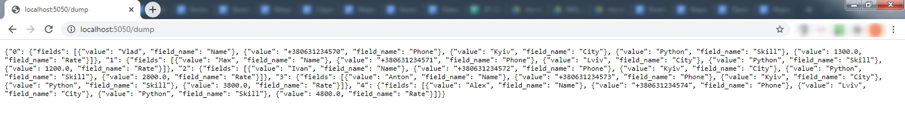

## Создание книги
Результатом прохождения данного мини-курса будет создание CRM-системы. В предыдущие дни мы познакомились с функциональными действиями и создали класс `Developer`, который описывает работу с информацией по конкретному разработчику.  
  
CRM-система - это много записей о разработчиках. Поэтому нам необходим класс, который будет описывать работу с набором разработчиков:  
* Хранить информацию о разработчиках.
* Добавлять, читать, изменять и удалять данные о разработчиках.
* Сохранить текущую информацию о разработчиках в файл.
* Загрузить информацию о разработчиках из файла.
* Удалить все записи.

Информацию о разработчике будем называть **записью**. 

### CRM "Печеньки"
Разбирать принципы работы CRM-системы мы будем на примере системы учета готовой продукции кондитерского производства по изготовлению печенья.
Назовем её CRM-система "Печеньки".

Основным классом CRM-системы "Печеньки" будет класс `CookieBook`, основной задачей которого будет хранить информацию о произведенных поштучно печеньках. 

```python
class CookieBook:
    def __init__(self):
        self.cookies = {}
        self.cookies_id = 0
```
При создании объекта класса `CookieBook` в нем будет создано поле `cookies`, которое имеет значение пустого словаря &mdash; в него будет добавляться информация. А также значение поля `cookies_id` равно 0. В нем будет храниться номер добавляемой записи.  

Когда класс создан  &mdash; осталось только создать объект соответствующего класса:
```python
class CookieBook:
    def __init__(self):
        self.cookies = {}
        self.cookies_id = 0

cb = CookieBook()
```

#### Задание
<div class = "useful">
Пока вы целый месяц проводили исследования, инвестор решил временно использовать ваших программистов на другом маленьком проекте. В итоге программистам там понравилось больше и возвращаться они не хотят.    
   
Вы понимаете, что должны самостоятельно сделать первую версию программы. Вы еще только Junior, но если хотите завершить свой проект, должны проявить смелость и стойкость и сделать задачи, которые гораздо превышают уровень новичка. Сдаться или закончить проект и гордиться собой-решать только вам.  
  
Первая задача - создать новый класс для AdressBook для того, чтобы иметь возможность не 1-м, а с большим количеством объектов класса Developer. сlass Developer воспринимается как строчка, а сlass AdressBook - как таблица.
</div>

1. Создайте класс `AddressBook`, в котором будет реализован метод `__init__`
2. В методе `__init__` заданы 2 поля: `self.developers` со значением пустого словаря ({}) и `self.last_developer_id` со значением 0
3. Создайте адресную книгу разработчиков (объект `ab` класса `AddressBook`)

## Добавление записей в книге

<details open>
  <summary>Теория</summary>

В прошлом задании на примере класса `CookieBook`, который является основным для `CRM "Печеньки"`, мы разобрали принцип работы класса, который в полях хранит другие классы. В практическом задании вы создали класс `AddressBook`, который является основным для `CRM "Разработчики"`

```python
#Класс, который описывает книгу по учету печенья
class CookieBook:
    def __init__(self):
        self.cookies = {}
        self.cookies_id = 0

#Создание объекта cb класса CookieBook
cb = CookieBook()
```

### Добавление элемента книги.
`CRM "Печеньки"` &mdash; это система учета, которая, по сути, заменяет бумажный журнал учета или амбарную книгу.
Сам класс `CookieBook` &mdash; это правила как вести такую книгу. А объект, который мы создадим &mdash; это сама книга. 

Одним из основных действий, которое производят с любой учетной книгой является добавление в неё записей. Что происходит, когда добавляется новая запись в учетную книгу? Появляется новая строка с номером на 1 больше чем предыдущая, и в неё заносятся данные.

```python
class CookieBook:
    def __init__(self):
        self.cookies = {}
        self.last_cookie_id = 0

    def add(self, cookie):
        self.cookies[self.last_cookie_id] = cookie  
        self.last_cookie_id += 1
```
В нашем примере в поле `self.cookies`, которое является словарем, по ключу `self.last_cookie_id` добавляется значение `cookie`, после этого `self.last_cookie_id` увеличивается на 1.
</details>

<h3 class="task">Задание</h3>
<div class = "useful">
Вторая задача - реализовать функционал добавления новых разработчиков в нашу книгу.
</div>

Для класса `AddressBook` реализуйте метод `add` для добавления новых элементов:
* метод `add` получает параметр `developer`;
* в поле `self.developers` добавляем "новую строку" со значением параметра `developer`, номер которой соответствует значению `self.last_developer_id` ;
* после добавление нового элемента в словарь `self.developers` значение `self.last_developer_id` увеличиваем на 1.


##  Удаление записей в книге

<details open>
  <summary>Теория</summary>

В прошлом задании &mdash; мы описали добавление записи о новом печенье в нашу книгу учета. Это было
```python
class CookieBook:
    def __init__(self):
        self.cookies = {}
        self.last_cookie_id = 0

    def add(self, cookie):
        self.cookies[self.last_cookie_id] = cookie  
        self.last_cookie_id += 1
```

#### Удаление записи из книги

На производстве печенья могут происходить различные ситуации, которые требуют удаления уже созданных записей. Например, при выпечке печений второе по счету печенье - пригорело. В результате - мы его убрали из списка готовой продукции, т.е. вычеркнули соответствующую строчку из книги учета.

```python
class CookieBook:
    def __init__(self):
        self.cookies = {}
        self.last_cookie_id = 0

    def add(self, cookie):
        self.cookies[self.last_cookie_id] = cookie  
        self.last_cookie_id += 1

    def delete(self, cookie_id: int):
        key = int(cookie_id)
        self.cookies.pop(key)
```
</details>

<h3 class="task">Задание</h3>
<div class = "useful">
Теперь реализуем удаление разработчиков из книги.
</div>

Напишите метод `delete` так, чтобы он удалял из словаря `self.developers` запись по ключу `key`:
* метод получает параметр `developer_id`
* переменная `key` получает значение `developer_id` приведенное к типу `int`
* с помощью метода `pop` из словаря `self.developers` удаляется элемент с номером `key`

## Обработка исключений при удалении записей

<details open>
  <summary>Теория</summary>

В прошлом задании мы реализовали удаление записей по номеру:

```python
class CookieBook:
    def __init__(self):
        self.cookies = {}
        self.last_cookie_id = 0

    def add(self, cookie):
        self.cookies[self.last_cookie_id] = cookie  
        self.last_cookie_id += 1

    def delete(self, cookie_id: int):
        key = int(cookie_id)
        self.cookies.pop(key)
```

#### Обработка исключений

Во время того, как, по какой-то причине, из книги учета вычеркивается та или иная строка, может возникнуть некорректная ситуация... Например, администратору учета на складе передали талон на удаление бракованного (пригоревшего) печенья, но на нем номер записи, которую нужно вычеркнуть, написан неразборчиво, либо же написан такой номер, которого не существует (например он уже удалял запись с таким номером).
В такой ситуации администратор учета "возмутиться".  

```python
class IncorrectInput(Exception):
    pass

class CookieBook:
    def __init__(self):
        self.cookies = {}
        self.last_cookie_id = 0

    def add(self, cookie):
        self.cookies[self.last_cookie_id] = cookie  
        self.last_cookie_id += 1

    def delete(self, cookie_id: int):
        try:
            key = int(cookie_id)
            self.cookies.pop(key)
        except TypeError:
            raise IncorrectInput(f"Cookie ID {cookie_id} is not int")
        except KeyError:
            raise IncorrectInput(f"Cookie {cookie_id} not found")

```

"Возмущение" интерпретатора реализуется через механизм исключений. 

</details>

<h3 class="task">Задание</h3>
<div class = "useful">
Вы помните, что бухгалтерия часто допускали механические ошибки при вводе значений. Поэтому решаете к функционалу удаления разработчика добавить исключения: 
а) чтобы убрать возможность удаления разработчика с несуществующим номером в книге, 
б) чтобы обработать ошибку при вводе не числа, а строки
</div>

Создайте метод `delete` с параметром `developer_id` так, чтобы он:
* удалял из словаря `self.developers` запись по ключу `key`, `key` получает значение `developer_id`, приведенное к целому числу.
* использовал конструкцию `try` ... `except` при приведении значения параметра к целому числу (`int`), а также при удалении элемента из словаря.
* при возникновении исключения `TypeError` (параметр, который передан не может быть приведен к целому числу) вызывается исключение с f-строкой: `f"Developer ID {developer_id} is not int"`
* при возникновении исключения `KeyError` (в словаре `self.developers` отсутствует запись с таким ключом) вызывается исключение с f-строкой: `f"Developer {developer_id} not found"`
* удалял из словаря `self.developers` запись по ключу `key`, а также вызывал собственное исключение `IncorrectInput`.


## Обновление записей в книге

<details open>
  <summary>Теория</summary>
  
В прошлом задании мы реализовали функционал удаления записей из книги учета с использованием механизма исключений
```python
class IncorrectInput(Exception):
    pass

class CookieBook:
    def __init__(self):
        self.cookies = {}
        self.last_cookie_id = 0

    def add(self, cookie):
        self.cookies[self.last_cookie_id] = cookie  
        self.last_cookie_id += 1

    def delete(self, cookie_id: int):
        try:#
            key = int(cookie_id)#
            self.cookies.pop(key)#  
        except TypeError:#
            raise IncorrectInput(f"Developer ID {cookie_id} is not int")#
        except KeyError:#
            raise IncorrectInput(f"Developer {cookie_id} not found")#
```
### Обновление записей в книге
Бывает ситуация, когда необходимо изменить уже записанные данные. Например, произошло повторное взвешивание и нужно обновить значение массы, либо изменилась цена и это нужно отразить в книге учета.  
```python
    def update_cookie(self, cookie_id, field_idx, value):
        cookie = self.cookies[cookie_id]
        cookie.update(field_idx, value)
```
Данный метод получает номер строки (`cookie_id`), номер поля, которое нужно изменить (`field_idx`) и значение, которое должно получить соответствующее поле в соответствующей строке.  
Полная реализация класса, описывающего книгу учета печенья:
```python
class CookieBook:
    def __init__(self):
        self.cookies = {}
        self.last_cookie_id = 0

    def add(self, cookie):
        self.cookies[self.last_cookie_id] = cookie  
        self.last_cookie_id += 1

    def delete(self, cookie_id: int):
        try:
            key = int(cookie_id)
            self.cookies.pop(key)  
        except TypeError:
            raise IncorrectInput(f"Developer ID {cookie_id} is not int")#
        except KeyError:
            raise IncorrectInput(f"Developer {cookie_id} not found")#
    
    def update_cookie(self, cookie_id, field_idx, value):
        cookie = self.cookies[cookie_id]
        cookie.update(field_idx, value)
```

</details>

<h3 class="task">Задание</h3>

Реализуйте метод `update_developer`, который изменяет значение поля в определенной строке.

Метод `update_developer` получает параметры  `developer_id` (номер разработчика), `field_idx` (номер поля), `value` (значение, которе нужно обновить)


## Удаление всех записей книги 

<details open>
  <summary>Теория</summary>

В прошлом задании мы реализовали возможность обновить значение полей:

```python
class CookieBook:
    def __init__(self):
        self.cookies = {}
        self.last_cookie_id = 0

    def add(self, cookie):
        self.cookies[self.last_cookie_id] = cookie  
        self.last_cookie_id += 1

    def delete(self, cookie_id: int):
        try:
            key = int(cookie_id)
            self.cookies.pop(key)  
        except TypeError:
            raise IncorrectInput(f"Developer ID {cookie_id} is not int")
        except KeyError:
            raise IncorrectInput(f"Developer {cookie_id} not found")
    
    def update_cookie(self, cookie_id, field_idx, value):
        cookie = self.cookies[cookie_id]
        cookie.update(field_idx, value)
```

Для того, чтобы не переполнялась память станции учета, раз в году все показатели производительности выгружаются, обрабатываются и архивируются. После этого, текущие данные на станции учета удаляются.

```python
class CookieBook:
    def __init__(self):
        self.cookies = {}
        self.last_cookie_id = 0

    def add(self, cookie):
        self.cookies[self.last_cookie_id] = cookie  
        self.last_cookie_id += 1

    def delete(self, cookie_id: int):
        try:
            key = int(cookie_id)
            self.cookies.pop(key)
        except TypeError:
            raise IncorrectInput(f"Developer ID {cookie_id} is not int")
        except KeyError:
            raise IncorrectInput(f"Developer {cookie_id} not found")
    
    def update_cookie(self, cookie_id, field_idx, value):
        cookie = self.cookies[cookie_id]
        cookie.update(field_idx, value)

    def clear_cookies(self):    
        self.cookies.clear()
        self.last_cookies_id = 0

```

</details>

<h3 class="task">Задание</h3>

<div class = "useful">
В Вашей системе можно будет работать не с 1 командой разработчиков, а постоянно добавлять новые. Для адекватной работы системы нужно очищать предыдущие данные.
</div>

Реализуйте метод `clear_developer`, который не получает параметров и который:
* очищает (удаляет все элементы) словарь `self.developers`;
* значение поля `self.last_developer_id` устанавливает равным `0`.


## Создание класса `AddressBook`

<details open>
  <summary>Теория</summary>
  
Всю свою историю человечество использует различные форматы передачи данных.  
Одними из самых первых были наскальные рисунки, потом письменные документы.  
Но скорость доставки бумажного листа ограничена скоростью лошади, везущий почтальона, как это было в средневековье, или скоростью самолета, поезда, машины в наше время.  
Первой попыткой использовать формат передачи данных, не привязанной к статическому материальному носителю, можно считать азбуку Морзе, когда буквы шифровались с помощью точек и тире, и передавались сначала светофорной сигнализацией, а затем - через телеграф.


Современный формат передачи данных `JSON` (JavaScript Object Notation) позволяет передавать переменные со значениями и целые объекты.
Ниже приведен пример данных для передачи курсов валют с сайта одного из банков в формате JSON
```python
[
    {"ccy":"USD","base_ccy":"UAH","buy":"27.20000","sale":"27.60000"},
    {"ccy":"EUR","base_ccy":"UAH","buy":"31.95000","sale":"32.60000"},
]
```
Формат хранения данных JSON является очень удобным для работы с ним и для передачи по сети, однако
JSON позволяет хранить только простые объекты и типы данных, в качестве ключей в словаре можно использовать только строки (`str`). 
### JSON dump

**JSON dump** - это "слепок" объекта, т.е. создание JSON-строки на основе текущего состояния объекта.
**Состояние объекта** - все значения полей объекта.
Процесс создания дампа называется **сериализацией**.

Дамп объекта применяется тогда, когда необходимо сохранить его состояние в файл или передать через Интернет.

В итоговой CRM-системе будет возможность создать дамп текущего состояния.  




### Функционал дампа в CRM "Печеньки"
Допустим, наша система учета формирует отчеты за день и передает их в мобильное приложение собственникам компании. Отчетом является перечисление типов печений, которые были испечены за день.
```python
import json
class Report_Cookies:
    def __init__(self,cookies):
        self.cookie_types = cookies
    
    def dumps(self):
        return json.dumps(self.cookie_types)

report1 = Report_Cookies(["sugar","sugar","oat","oat","sugar",,"macaroon"])
print(report1.dumps())#["sugar", "sugar", "oat", "macaroon"]
```
В данной программе мы создали дополнительный класс `Report_Cookies`, реализовали в нем метод `dump`, а также создали объект `report1` класса `Report_Cookies` выполнив метод `dumps` этого объекта.
</details>

<h3 class="task">Задание</h3>

<div class = "useful">
Для того, чтобы не потерять данные о старых и новых командах, нам нужно создавать резервные копии-сохранять данные.
Наиболее распространенным форматом для хранения и передачи данных является JSON. JSON - новый формат для хранения данных в нашей системе. Чтобы его внедрить, нам нужно разобраться с тем, как в него переводить все реализуемые нами структуры (словари, списки, списки словарей, объекты).
</div>

1. Напишите метод `dumps` класса `AddressBook` так, чтобы он возвращал дамп словаря `self.developers` в формате JSON.


## Десериализация

<details open>
  <summary>Теория</summary>
В прошлом задании мы с вами реализовали класс, который создает из класса JSON-строку для передачи другому приложению.

```python
import json
class Report_Cookies:
    def __init__(self,cookies):
        self.cookie_types = cookies
    
    def dump(self):
        return json.dumps(self.cookie_types)

report1 = Report_Cookies(["sugar","sugar","oat","oat","sugar",,"macaroon"])
print(report1.dump())#["sugar", "sugar", "oat", "macaroon"]
```
### Десериализация
В этом задании опишем тот функционал, который необходим для обработки строки, которую отправила написанная выше программа через Интернет.
Программа - получает данные, полученные из Интернет (переменная `string`), преобразует её в нужную структуру.
```python
import json
string = '["sugar","sugar","oat","macaroon"]'

class Report_Get:
    def __init__(self):
        self.cookie_types = []
    
    def loads(self, json_string):
        self.cookie_types = json.loads(json_string)

report_get = Report_Get()
report_get.loads(string)
print(report_get.cookie_types) #['sugar', 'sugar', 'oat', 'macaroon']
```

</details>

<h3 class="task">Задание</h3>

<div class = "useful">
Загружаем файл JSON с информацией о текущей команде. 
</div>

1. Создайте метод `loads` класса `AddressBook` так, чтобы он проводил десериализацию
    аргумента `json_bytes` в словарь `self.developers`.


## JSON

<details open>
  <summary>Теория</summary>
В программировании при описании определенных структур существует договоренность:

* список указывать в квадратных скобках `[]`
* словарь указывать в фигурных скобках `{}`
* строки всегда заключаются в одинарные `''` или двойные `""` кавычки

Для чего это помнить? 
В прошлых заданиях мы с вами познакомились с форматом передачи данных JSON. Он умеет существующие переменные переводить в строку определенного формата и обратно.
Это актуально для сложных типов данных &mdash; таких как списки, словари, объекты. Потому что простые данные (целые числа, строки) получается передавать через Интернет без проблем.

Зачем нужен JSON? Для того, чтобы сделать резервную копию.
В этом и ряде последующих заданий мы разберемся с форматом JSON для того, чтобы реализовать сохранение данных.

Перевод простых типов переменных в JSON соответствует приведению их типу `str`

#### Список в JSON-формате
Самым простым типом данных, для которого перевод в JSON-формат имеет смысл является список.
Если мы зададим список с использованием квадратных скобок, то перевод его в JSON-формат будет представлять строку аналогичную тому, как список записывается
```python
lst = [1,2,3]
jsn = json.dumps(lst)
print(jsn)#[1, 2, 3]
```
Но список можно задавать и с использованием метода `append`
```python
lst = []
lst.append(1)
lst.append(2)
lst.append(3)
jsn = json.dumps(lst)
print(jsn)#[1, 2, 3]
```
<div class="useful">
<h5>DUMP</h5>
<p>Результат перевода переменной в JSON-строку называют **JSON-дамп** или просто **дамп**.</p>
</div>

</details>

<h3 class="task">Задание</h3>

Реализуйте список `lst` таким образом, чтобы его JSON-дамп `jsn` имел вид `[5,6,7,8]`.


## JSON

<details open>
  <summary>Теория</summary>
Используя чтение формата JSON можно задавать значения, которые можно, как и любые другие элементы в программе менять.

```python
import json
jsn = '["cookie_type", "cookie_weight", "price", "energy"]'
obj = json.loads(jsn)
obj[1] = "weight"
print(obj)
```
<div class="attention">
<h5>Внимание</h5>
<p>Для задания JSON-строку обязательно используются двойные кавычки для обозначения строк.</p>
<p>["cookie_type", "cookie_weight", "price", "energy"] - верно.</p>
<p>['cookie_type', 'cookie_weight', 'price', 'energy'] - вызовет ошибку.</p>

</div>
</details>

<h3 class="task">Задание</h3>

1. Задание значение JSON-строки `jsn` (`["name","city","skill","rate","phone"]`).
2. Получите значение переменной `obj` как результат десериализации JSON-строки `jsn`

## JSON

<details open>
  <summary>Теория</summary>

Нашей целью является учет нескольких печений. Учет печений мы производим с помощью словаря. А для работы с несколькими однотипными элементами мы используем список. В итоге для того, чтобы сохранить информацию о нескольких печений создадим список словарей и переведем его в JSON-строку.
Для простоты восприятия возьмем только два ключа для словарей: тип печенья (`cookie_type`) и вес (`weight`).  
Создадим список из трёх печений: сахарного печенья весом 150 грамм, сахарного печенья весом 250 грамм и овсяного печенья весом 200 грамм.

```python
import json

c1 = {'cookie_type': 'sugar', 'weight': 150 }
c2 = {'cookie_type': 'sugar', 'weight': 250 }
c3 = {'cookie_type': 'out',   'weight': 200 }

cookie_list = [c1,c2,c3]

jsn  = json.dumps(cookie_list)
# [
# {"cookie_type": "sugar", "weight": 150}, 
# {"cookie_type": "sugar", "weight": 250}, 
# {"cookie_type": "out", "weight": 200}
# ]
```

</div>
</details>

<h3 class="task">Задание</h3>

<div class = "useful">
Вы уже создали список словарей как структуру, в которой хранится информация о разработчиках.
Теперь Вам нужно научиться эту структуру переводить в JSON. 
</div>

Используйте словарь, в котором задана информация о разработчике
1. Создайте переменную `developer2`, которой присвойте описание разработчика: имя (name) `Vlad`, уровень оплаты (Rate) `2300`.
2. Создайте переменную `developer3`, которой присвойте описание разработчика: имя (name) `Ivan`, уровень оплаты (Rate) `2700`.
3. Создайте список `developer_list`, который состоит из переменных `developer1`, `developer2`, `developer3`.
4. Получите значение переменной `jsn`, как результат сериализации переменной `developer_list`.

## JSON

<details open>
  <summary>Теория</summary>
Второй итерируемый тип данных, который используется для работы с JSON - это словарь.
Допустим нам необходимо сохранить данные о конкретном печенье. 
Печенье у нас хранится в словаре вида.

```python
import json

cookie = {
    'cookie_type': 'sugar',
    'weight': 150,
    'price': 1.5,
    'energy': 250
}

cookie['weight'] = 75

jsn  = json.dumps(cookie)
```

</div>
</details>

<h3 class="task">Задание</h3>

<div class = "useful">
Теперь учимся переводить словарь с данными о разработчике в формат JSON.
</div>

Используйте словарь, в котором задана информация о разработчике
1. Измените уровень оплаты разработчика на 2000.
2. Получите значение переменной `jsn` как результат сериализации объекта `developer`

## Десериализации объектов Python из JSON

<details open>
  <summary>Теория</summary>


#### Из JSON в класс
Загрузили из источника (из Интернета или локального файла) JSON-строку. В прошлом задании мы с вами разобрали то, как эту строку можно перевести в переменную.
```python
import json
string = '["sugar","sugar","oat","macaroon"]'

class Report_Get:
    def __init__(self):
        self.cookie_types = []
    
    def loads(self, json_string):
        self.cookie_types = json.loads(json_string)

report_get = Report_Get()
report_get.loads(string)
print(report_get.cookie_types) #['sugar', 'sugar', 'oat', 'macaroon']
```

Формат JSON-строки, которая соответствует созданной CRM "Печеньки".
```python
jsn ='''{
"0": {"fields": [
    {"value": "sugar", "field_name": "cookie_type"}, 
    {"value": "150", "field_name": "wieght"}]}, 
"1": {"fields": 
    [{"value": "sugar", "field_name": "cookie_type"}, 
    {"value": "250", "field_name": "wieght"}]},
"2": {"fields": 
    [{"value": "oat", "field_name": "cookie_type"}, 
    {"value": "200", "field_name": "wieght"}]},
}
'''
```
Обратите внимание, чтобы присвоить строку, которая занимает несколько строк (в ней символы перевода строки) используется оператор `'''`  
Такую строку мы можем отправить через Интернет, сохранить в файл и получить из Интернета и прочитать из файла.  
Предположим, что мы из файла загрузили информацию о выпечке за прошлый день. И посчитаем количество выпущенных печений.
```python
import json

jsn ='''{
"0": {"fields": [
    {"value": "sugar", "field_name": "cookie_type"}, 
    {"value": "150", "field_name": "wieght"}]}, 
"1": {"fields": 
    [{"value": "sugar", "field_name": "cookie_type"}, 
    {"value": "250", "field_name": "wieght"}]},
"2": {"fields": 
    [{"value": "oat", "field_name": "cookie_type"}, 
    {"value": "200", "field_name": "wieght"}]}
}
'''
elem = json.loads(jsn)
print(len(elem))# вернет 3
```
Разберем структуру того объекта, который получается в результате десериализации (преобразования JSON-строки в объект)
```python
import json

jsn ='''{
"0": {"fields": [
    {"value": "sugar", "field_name": "cookie_type"}, 
    {"value": "150", "field_name": "wieght"}]}, 
"1": {"fields": 
    [{"value": "sugar", "field_name": "cookie_type"}, 
    {"value": "250", "field_name": "wieght"}]},
"2": {"fields": 
    [{"value": "oat", "field_name": "cookie_type"}, 
    {"value": "200", "field_name": "wieght"}]}
}''' 

elem = json.loads(jsn)
print(elem)
# {'0': {'fields': [{'value': 'sugar', 'field_name': 'cookie_type'}, {'value': '150', 'field_name': 'wieght'}]}, '1': {'fields': [{'value': 'sugar', 'field_name': 'cookie_type'}, {'value': '250', 'field_name': 'wieght'}]}, '2': {'fields': [{'value': 'oat', 'field_name': 'cookie_type'}, {'value': '200', 'field_name': 'wieght'}]}}

print(elem['0'])
# {'fields': [{'value': 'sugar', 'field_name': 'cookie_type'}, {'value': '150', 'field_name': 'wieght'}]}

print(elem['0']['fields'])
# [{'value': 'sugar', 'field_name': 'cookie_type'}, {'value': '150', 'field_name': 'wieght'}]

print(elem['0']['fields'][0])
# {'value': 'sugar', 'field_name': 'cookie_type'}

print(elem['0']['fields'][0]['field_name'])
# cookie_type

print(elem['0']['fields'][0]['value'])
# sugar
```

Т.е. чтобы получить  итоговое значение нам нужно указать:
* `['0']` - номер испеченного печенья, 
* `['fields']` - пишем всегда, т.к. данные о печеньях у нас храняться в поле `'fields'`, 
* `[0]` - номер поля с информацией о печенье (0 это информация о типе печенья, 1 - информация о веcе печенья)

Выведем, например тип третьего печенья и сумму весом за день:
```python
import json

jsn ='''{
"0": {"fields": [
    {"value": "sugar", "field_name": "cookie_type"}, 
    {"value": "150", "field_name": "wieght"}]}, 
"1": {"fields": 
    [{"value": "sugar", "field_name": "cookie_type"}, 
    {"value": "250", "field_name": "wieght"}]},
"2": {"fields": 
    [{"value": "oat", "field_name": "cookie_type"}, 
    {"value": "200", "field_name": "wieght"}]}
}''' 

elem = json.loads(jsn)

type_3 = elem['2']['fields'][0]['value']# oat
weight_1_2_3 = int(elem['0']['fields'][1]['value']) + int(elem['1']['fields'][1]['value']) + int(elem['2']['fields'][1]['value'])
```
</details>

<h3 class="task">Задание</h3>

<div class = "useful">

У нас есть информация о разработчиках, сохраненная в формате JSON (как текстовый файл). 
Чтобы начать работать с этой информацией нам нужно ее передать нашей программе. То есть преобразовать JSON-строку в список словарей, чтобы наша система могла работать с этими данными о зарплатах разработчиков.  
  
Это важно сделать, потому что система напрямую с JSON работать не может, а со списком словарей - может. 
Поэтому в этой задаче учимся читать из формата JSON список словарей.
</div>

1. Получите объект, в котором хранится информация о разработчиках из JSON-строки `jsn`.
2. Присвойте переменной `name_3` имя третьего по счету разработчика.
3. Присвойте переменной `rate_1_2_3` сумму уровней оплат разработчиков.


## Десериализации объектов Python из JSON

<details open>
  <summary>Теория</summary>
В прошлом задании мы разобрались как из JSON-строки получить объект нужного класса в Python.  
Но в Python, после десериализации (получения переменной из JSON-строки) можно получить только стандартные типы переменных: списки, словари. На практике же, необходимо получить значения в виде классов, которые используются в программе. У нас ведь именно такая архитектура данных &mdash; мы каждое поле храним в объекте, информацию о печенье и в целом вся информация в CRM &mdash; это также объект. А сохранить в файл или переслать через Интернет мы можем только текст в формате JSON.

```python
import json
class CookieDataField:
    field_description = "General"
    def __init__(self, value):
        self.value = value
    def __str__(self):
        return f"{self.field_description}:{self.value}"

class CookieType(CookieDataField):
    field_description = "cookie_type"

jsn ='{"value": "sugar", "field_name": "cookie_type"}' #JSON-объект

elem=json.loads(jsn)#Десериализация

key = elem['field_name']#sugar
val = elem['value']#cookie_type

obj = CookieType(val)#Создаем объект класса CookieType
print(obj)#cookie_type:sugar
```
</details>
В данном примере мы получили из строки `jsn` необходимые значения и создали на их основе полноценный класс `CookieType` с начальным значением.


<h3 class="task">Задание</h3>
<div class = "useful">
Формат JSON можно преобразовать только в простые структуры. А наша система работает на классах(более сложной структуре, которую нельзя напрямую получить из JSON). Поэтому нам необходимо из полученного из JSON-строки словаря создать объект с нужными данными. 
</div>


1. Переменной `elem` присвойте объект, в котором хранится информация о разработчиках из JSON-строки `jsn`.
2. Переменной `obj` присвойте объект класса `FirstNameField`, со значением поля `value` равное значению, которое хранится в объекте `elem` по ключу `value`.


## Десериализации объектов Python из JSON

<details open>
  <summary>Теория</summary>
  
В прошлом задании мы разобрали десериализацию объекта `CookieType`. Но в итоговой CRM-системе "Печеньки" у нас 2 объекта-наследника `CookieDataField` (`CookieType`, `CookieWeight`) и в JSON-строке не один объект.  
Нам необходим механизм преобразования из словаря в соответствующий объект.
Для этого возьмем специальный объект

```python
registered_fields = {
        'cookie_type': CookieType,
        'wieght': CookieWeight
    }
```
Он позволяет по названию поля возвращать объект соответствующего класса.

```python
registered_fields = {
        'cookie_type': CookieType,
        'wieght': CookieWeight
    }

obj = registered_fields['cookie_type'] #Класс CookieType
elem = obj('sugar') # Объект класса CookieType со значением 'sugar'
print(elem)#cookie_type:sugar
```
В результате мы можем написать функцию, которая получает JSON-строку и с помощью переменной registered_fields возвращает соответствующий ей объект.
```python
def field_decoder(json_in):
    name  = json_in["field_name"] #Получаем название поля
    value = json_in["value"] # Получаем значение

    obj_class = registered_fields[name] #с помощью переменной registered_fields создаем объект нужного класса
    field = obj_class(value) # в объект созданного класса передаем значение value
    return field #Возвращаем объект
```

Соберем полностью программу:
```python
import json
jsn ='''[
    {"value": "sugar", "field_name": "cookie_type"}, 
    {"value": "150", "field_name": "wieght"} 
    ]
'''
class CookieDataField:
    field_description = "General"

    def __init__(self, value):
        self.value = value

    def __str__(self):
        return f"{self.field_description}:{self.value}"

class CookieType(CookieDataField):
    field_description = "cookie_type"

class CookieWeight(CookieDataField):
    field_description = "wieght"

registered_fields = {
        'cookie_type': CookieType,
        'wieght': CookieWeight
    }

def field_decoder(json_in):
    name  = json_in["field_name"] #Получаем название поля
    value = json_in["value"] # Получаем значение

    obj_class = registered_fields[name] #с помощью переменной registered_fields создаем объект нужного класса
    field = obj_class(value) # в объект созданного класса передаем значение value
    return field #Возвращаем объект


elem = json.loads(jsn)

res_obj = field_decoder(elem[0])
print(res_obj) #cookie_type:sugar

```
</details>

<h3 class="task">Задание</h3>

<div class = "useful">
Супер, вы уже делаете практически невозможное для джуна.
Осталось поставить преобразование словарей в объекты на поток. Для этого напишите специальную функцию, которая будет получать словарь с названием класса и его начальным значением и возвращать новый объект. 
</div>

Реализуйте функцию `field_decoder`, которая:
* получает JSON-строку
* возвращает объект, который соответствует значению словаря по ключу `field_name` в словаре,
* возвращаемый объект должен иметь значение, которое соответствует значению словаря по ключу `value` 
* для преобразования из словаря в объект используйте  `REGISTERED_FIELDS`


## Фреймворк Flask

<details open>
  <summary>Теория</summary>

#### Web-сервер
При обсуждении направлений развития CRM-системы "Печеньки" было принято решение переводить её в формат `Web-приложения`.  
В качестве технологии реализации был выбран один из самых распространенных в Python `фреймворк Flask`.  

Результатом запуска программы с использованием данного фреймворка будет работающий web-сервер.    
  
**Web-сервер** &mdash; это программа, которая имеет функционал получения запроса и отправки ответа на него. 

Т.е. с помощью `Flask` мы создадим функционал, который позволит нам принимать запросы от пользователя и генерировать нужный ответ.


Один из самых известных серверов &mdash; Google (поисковой сервер):  


Когда мы в нашем браузере пишем `google.com` этим мы отправляем запрос на сервер `Google`. Получив этот запрос Google отправит ответ в виде кода главной страницы `google.com`.

#### Web-клиент
Наш браузер &mdash; программа, которая является Web-клиентом.

**Web-клиент** &mdash; программа, которая отправляет запросы различным **web-серверам**, получает ответы от них и представляет их пользователю.

Простое Web-приложение на Flask:

```python
from flask import Flask

app = Flask("Hello")

@app.route("/hello")
def fields():
    response = 'Hello, World!'  
    return response

if __name__ == '__main__':
    app.run()
```
Это приложение запускается на компьютере программиста как сервер. По адресу `http://127.0.0.1:5000/hello/` вы увидите результат его работы: 


Если аналогичную программу разместить на специальном компьютере на технической площадке провайдера &mdash; к нему можно будет обращаться со всех компьютеров подключенных к Интернет

</details>

<h3 class="task">Задание</h3>

<div class = "useful">
Вы уже сделали полную структуру для оффлайн-работы первой версии вашей системы. Вы не знаете как, но Вы это сделали и система реально заработала у вас локально.   
  
Но теперь инвестор просит сделать так, чтобы у него на компьютере в браузере эта версия тоже заработала. Для этого нужно поднять сервер. Вы, конечно, никогда сервер не поднимали. Но решаете не сдаваться, ведь до следующего раунда инвестиций остается всего 1 шаг.  
  
Вы решаете использовать готовые библиотеки для поднятия сервера. Читаете море литературы, советуетесь с другими разработчиками и решаете использовать фреймворк Flask.
По традиции начинаете использование новой технологии с Hello,World в учебный целях.
</div>

Реализуйте программу, которая запускает сервер на фреймворке Flask и по запросу `/hello` выводил бы строку `Hello, World! I have startup!`

## Фреймворк Flask

<details open>
  <summary>Теория</summary>

В прошлом задании мы запустили фреймворк `Flask` и вывели на экран строку `Hello, World!`
В прошлом задании мы запустили фреймворк `Flask` и вывели на экран строку `Hello, World! I have startup!`

#### Вывод зарегистрированных полей в CRM __Печеньки__

В CRM __Печеньки__ данные хранятся в объектах, словарях и списках. Задача сервера &mdash; генерировать JSON-строку, которую прочитает FrontEnd-программа и сделает доступной для понимания пользователя.  
Первой задачей, которая будет реализована в CRM __Печеньки__ с использованием сервера будет вывод названий столбцов итоговой таблицы пользователей.


```python
from flask import Flask, jsonify

registered_fields = ["cookie_type", "weight", "price", "energy"]

app = Flask("Fields")

@app.route("/fields")
def fields():
    response = jsonify(registered_fields)
    return response

app.run()
```

Список, в котором находятся название зарегистрированных полей:
`registered_fields = ["cookie_type", "weight", "price", "energy"]`  

JSON - строка, созданная из списка `registered_fields`:  
`response = jsonify(registered_fields)`

`@app.route("/fields")` &mdash; это специальная конструкция (декоратор). Данный декоратор запускает функцию, которая следует далее при условии, что к серверу обратились по адресу `/fields`

</details>

<h3 class="task">Задание</h3>

<div class = "useful">
Отличие онлайн-системы от оффлайн в том, что взаимодействие с пользователем идет через адресную строку браузера. 
Основная задача, которую Вы должны реализовать: связать уже реализованный функционал системы с адресной строкой браузера и вывести результат в браузер.
</div>

Доработайте функциию `fields` так, чтобы она возвращала сконвертированный  в JSON-строку список `FIELDS`.

## Фреймворк Flask

<details open>
  <summary>Теория</summary>


В прошлом задании мы вывели в браузер список полей CRM __Печеньки__

#### Вывод информации о печенье в CRM __Печеньки__

Основной задачей CRM __Печеньки__ является вывод информации о конкретном печенье. Для первой итерации решено выводить словарь с информацией о типе печенья (`cookie_type`) и его весе (`weight`)

```python
from flask import Flask, jsonify

cookie = "['cookie_type': 'sugar', 'weight': '150']"

app = Flask("Cookie")

@app.route("/cookie")
def fields():
    response = jsonify(cookie)
    return response

app.run()
```


</details>

<h3 class="task">Задание</h3>

Добавьте словарю `developer`:
1. По ключу `Name` значение `Peter`
2. По ключу `Rate` значение `1800`


## Query string

<details open>
  <summary>Теория</summary>

В прошлом задании мы запустили Web-сервер, используя фреймворк `Flask`.

*Повторим:* 
**Web-сервер** &mdash;  программа сервер получает запрос и генерирует ответ на этот запрос.  

**Web-клиент** &mdash; программа, которая отправляет запросы различным **web-серверам**, получает ответы от них и представляет их пользователю.  

Весь Интернет состоит **только** из клиентов и серверов.  

На одном компьютере может одновременно работать программа-клиент и программа-сервер.  

#### Интернет-адрес
Основная составляющая запроса &mdash; это `URL` (Uniform Resource Locator). `URL` &mdash; это Интернет-адрес.

Фактически, URL &mdash; это строка и доменом сайта (`http://google.com`) IP-адресом (`http://127.0.0.1`). 


**IP-адрес** &mdash; специальный числовой Интернет-адрес, который состоит из 4-х чисел от 0 до 255, разделенных точкой.
#### Работа с URL
Обращение в Интернет по адресу похоже на работу традиционной почтовой службы.
Существует адрес по которому доставляется письмо: в случае с Интернет &mdash; это Интернет-адрес, для локальной реализации сервера на `Flask` &mdash; это `http://127.0.0.1/`  
  
В почтовом адресе есть номер квартиры / офиса. В случае с Интернет это будет "хвост" после названия адреса. Например `/fields`.  

В письме также есть поле "Кому" &mdash; это "дополнительный параметр", в соответствии с ним письмо попадет сыну или отцу; директору, руководителю отдела маркетинга или главному бухгалтеру.  

В Интернет адресах такие "дополнительные параметры", реализованы через `'query' строки`.

Такая строка с параметрами отделяется от URL символом `?`
Примеры URL содержащих `query`:
* `https://www.google.com/search?q=python`  

Это реальная строка с сервера Google. В ней параметром является `q`, а значением `python`  
  

#### Query-strings in Flask

Что получить значение параметра `all` запрос `http://127.0.0.1/search?all=N` напишем следующую программу:
```python
all_parameter = request.args["all"] # N
```

в переменную `all_parameter` будет сохранена строка `'N'`.

Самой простой программой-сервером, которая отвечает на запросы пользователя является эхо-сервер.  
Эхо-сервер возвращает клиенту значение идентичное полученному.

```python
from flask import Flask, request

app = Flask("Search")

@app.route("/echo")
def echo():
    to_echo = request.args["echo"]
    return to_echo

app.run()
```

Если вызвать такую программу по адресу `http://localhost/server?echo=Hello!`,
такая программа вернет значение `Hello!`.

</details>

<h3 class="task">Задание</h3>

Исправьте функцию обработчик запроса на ресурс `search` так, чтобы она сохраняла в `developer_name` параметр `name` из
`query`-строки запроса.

## GET параметры

<details open>
  <summary>Теория</summary>

#### Объект `request`

В прошлом задании мы разобрали, что для обработки параметров и их значений, которые поступили в функцию используется параметр `request`.

```python
from flask import request

@app.route("/print")
def print_request():
    print(request.path)
```
Если создать функцию как в примере, то при обращении в URL "/print" вы увидите в консоли строку `'/print'` -
эта строка хранилась в поле `path` объекта `request` и мы вывели её в консоль функцией `print`.

#### Получение Query-параметров в виде словаря

Но технологии даже на почте не стоят на месте и стали использоваться штрих-коды, читая которые сразу можно получить все данные из письма. 
В случае с атрибутом `args` объекта `request` пару ключ-значение можно превратить в словарь с помощью встроенного метода `to_dict`

```python
@app.route("/print")
def print_request():
    print(request.args.to_dict())
```

В такой реализации при обращении в URL "/print?name=Ivan" вы увидите в консоли словарь `{"name":"Ivan"}`.

</details>

<h3 class="task">Задание</h3>

Модифицируйте функцию `search` так, чтобы переменная `search_query` получила словарь Query-параметров из запроса.

## GET параметры

<details open>
  <summary>Теория</summary>

#### Объект `request`

В прошлом задании мы разобрали, что для обработки параметров и их значений, которые поступили в функцию используется параметр `request`.

```python
from flask import request

@app.route("/print")
def print_request():
    print(request.path)
```
Если создать функцию как в примере, то при обращении в URL "/print" вы увидите в консоли строку `'/print'` -
эта строка хранилась в поле `path` объекта `request` и мы вывели её в консоль функцией `print`.

#### Получение Query-параметров в виде словаря

Но технологии даже на почте не стоят на месте и стали использоваться штрих-коды, читая которые сразу можно получить все данные из письма. 
В случае с атрибутом `args` объекта `request` пару ключ-значение можно превратить в словарь с помощью встроенного метода `to_dict`

```python
@app.route("/print")
def print_request():
    print(request.args.to_dict())
```

В такой реализации при обращении в URL "/print?name=Ivan" вы увидите в консоли словарь `{"name":"Ivan"}`.

#### Получение значений словаря Query-параметров по ключу
Бывают ситуации, когда необходимо получить не весь словарь в целом, а отдельное его значение.
```python
@app.route("/print")
def print_request():
    name = request.args["Name"]
    rate = request.args["Rate"]
    print("Имя разработчика: "+name)
    print("Уровень зарплаты разработчика: "+rate)
```


</details>

<h3 class="task">Задание</h3>

1. Присвойте переменной `request_name` значение параметров, получаемых сервером по ключу `Name`
2. Присвойте переменной `request_rate` значение параметров, получаемых сервером по ключу `Rate`

## Фреймворк Flask. `BODY` и `Path` параметры

<details open>
  <summary>Теория</summary>

#### Path-параметры 
Продолжая аналогию с почтой &mdash; существуют большие организации, у которых есть адрес и номер комнаты. При этом, в зависимости от номера комнаты, письмо может проходить разные форматы сортировки.  
Например, в университете, который находится в одном здании, работает отдельная почтовая служба, при этом почта сортируется и разносится по различным факультетам.  

В нашей CRM "Печеньки" решено реализовать отдельную страницу для каждого печенья. Адрес такой страницы будет иметь вид `http://127.0.0.1/cb/cookie/5` , где 5 &mdash; это номер (id) соответствующей печеньки.

```python
@app.route("/cb/cookie/<cookie_id>")
def new_field(cookie_id):
    print(cookie_id)
```
В данной программе мы знаем, что `/cb/cookie/` &mdash; это основной адрес, а `<cookie_id>` &mdash; это как номер аудитории. Из-за того, что мы его так отметили &mdash; при обращении по адресу `http://127.0.0.1/ab/record/5` параметр `cookie_id` в функции `def new_field(cookie_id):` получит значение `10`.

**Path-параметр** &mdash; это часть URL (Internet-адреса), которую мы хотим обработать отдельным образом и выделяем в качестве параметра.

Для получения path-параметра используется специальная конструкция &mdash; декоратор `@app.route`, который должен содержать часть URL и название параметра выделенное символами `<`,`>`. Значение параметра декоратор передаст в функцию следующую сразу за ним в коде программы.

#### `Body` параметры
Но письма отличаются не только по адресу, но и по содержимому. При этом, если это, например, открытка то все данные при её отправке открыты. А если информация, которая пересылается, конфиденциальна, то она пересылается в закрытом письме.

```python
from flask import request

@app.route("/ab", methods=["POST"])
def new_field():
    field_name = request.json["name"]
    return f"В поле name: '{field_name}'"
```
Аналогом закрытого письма является передача данных методом `POST` (передача данных в адресе &mdash; метод `GET`).
Чтобы получить данные в таком формате необходимо указать в декораторе` @app.route("/ab", methods=["POST"])` после строки с адресом параметр `methods=["POST"]`

Если обратиться на `http://127.0.0.1/cb`, а в теле запроса указать: `{"cookie_type": "sugar"}`, то в ответ получите `В поле cookie_type: 'sugar'`.

</details>

<h3 class="task">Задание</h3>

На вход `new_field` приходит JSON-строка в теле запроса. В JSON сериализирован словарь с ключом `'name'`.  
Измените функцию `new_field` так, чтобы в переменной `field_name` сохранялось значение из тела запроса по ключу `'name'`.

## Интеграция `AddressBook` в Web-приложении на Flask

<details open>
  <summary>Теория</summary>
  
После отработки технологии создания Web-приложения было принято решение перенести на данную технологию уже созданную часть программы по учету печенья. Теперь CRM "Печеньки" становится Web-ориентированной.

Пока одна часть команды разрабатывала Web-платформу, вторая - дописала ещё несколько методов, которые ищут элементы, которые удовлетворяют условиям поиска.
```python
    def str_search(self, search_str: str):
        result = {}
        for cookie_id, cookie in self.cookies.items():
            if search_str in cookie:
                result[cookie_id] = cookie
        return result

    def multiple_search(self, **search_items):
        result = {}
        for cookie_id, cookie in self.cookies.items():
            if cookie.multiple_search(**search_items):
                result[cookie_id] = cookie
        return result
```

В параметре `**search_items` &mdash; две звездочки означают, что такой параметр может быть передан, а может и не быть передан и при этом программа не выдаст ошибку.


Если параметр есть `"all"`, то вызывается метод `multiple_search`, в другом случае вызывается метод `str_search`.

Основным классом в CRM "Печеньки" является `CookieBook`. А основным объектов назовем `СB`.  
Важным компонентом CRM
системы является поиск по одному/нескольким/всем полям. Создадим функцию, которая будет отвечать за этот функционал
и зарегистрируем ее на нашем сервере с URL `'/cb/search'`:

```python
@app.route("/ab/search")
def search():
    pass
```

Параметры поиска удобно передать как Query-параметры, чтобы получить к ним доступ в `search`.
Воспользуемся методом `request.args.to_dict`.

Договоримся, что для поиска по всем параметрам в Query-параметры будет передаваться параметр `'all'`.

Напомним, что в JSON ключом в словаре может быть только строка, поэтому перед отправкой клиенту ответа
все ключи словаря (в `CookieBook` ключами являются целые числа, `int`) необходимо конвертировать в строку с
помощью встроенной функции `str`.

Остается только реализовать логику поиска по всем записям `CookieBook` в функции `search`.

#### Поиск по всем записям

Для поиска по всем записям в `CookieBook` используется метод `str_search`, который получает строку по которому будет вестись
поиск.

```python
# Создадим объект класса AddressBook
СB = CookieBook()
c1 = Cookie()
c1.add(CookieType("Sugar"))
СB.add(c1)

# Воспользуемся поиском по всем полям
search_result = CB.str_search("sugar")
print(search_result)    # Выведет {0: Cookie} если в CB есть запись где в поле "cookie_type" строка "sugar"

search_result = CB.str_search("oat")
print(search_result)    # Выведет {} если в CB нет записей со строкой "oat"
```

#### Поиск по нескольким полям

Поиск по нескольким полям в `CookieBook` реализовано в методе `multiple_search`.

```python
CB = CookieBook()
c1 = Cookie()
c1.add(CookieType("sugar"))
c1.add(CookieWeight(150))
CB.add(c1)

search_dict = {"cookie_type": "sugar", "weight": "150"}
search_result = CB.multiple_search(**search_dict)
print(search_result)    # Выведет {0: Cookie}

search_dict = {"cookie_type": "sugar", "cookie_type": "250"}
search_result = CB.multiple_search(**search_dict)
print(search_result)    # Выведет {}, ведь наша запись c1 не содержит поле cookie_type равной "250"
```

</details>

<h3 class="task">Задание</h3>

Модифицируйте функцию `search` так, чтобы если передан не Query-параметр `'all'`, переменная `search_result` получала результаты поиска
по некоторым полям (метод `AB.multiple_search` с параметром `**search_query`).

## СRM - система "Разработчики Украины"

<details open>
  <summary>Теория</summary>
  
Пора сложить вместе все классы, методы и функции, которые мы с вами написали и запустить Web-приложение
__Разработчики Украины__.

Для этого мы создали:
* `IncorrectInput` и `FieldDecodeError` для обработки некорректных данных, введенных пользователем.
* Функцию `index_error_decorator` для обработки ситуации, когда пользователь вводит неправильный индекс
* Функцию `get_rate_stat` для расчета зарплатной статистики.
* Класс `DataField`, который является родительским для всех полей нашей CRM и отвечает за преобразование
    объектов `DataField` в словарь, логику создания новых объектов, проверку на соответствие значения
    записанного в объекте и аргумента.
* Классы `RateField`, `PhoneField`, `SkillField`, `CityField`, `FirstNameField` для полей нашей CRM, которые отвечают за корректные названия
    полей и валидацию введенных данных.
* Функцию `field_decoder`, которая превращает JSON объекты в `DataField` объекты.
* Класс `Developer`, который отвечает за объединение нескольких полей `DataField` в один объект &mdash;
    запись в нашей CRM, а также за поиск по всем или некоторым полям.
* Класс `AddressBook`, ответственный за сохранение записей и манипуляции с ними, поиск по всем записям,
    сохранение данных в JSON и восстановаления JSON, а также за объект этого класса `AB`, с которым будет работать
    Web-приложение.
* Объект `app` &mdash; Web-приложение
* Функции, отвечающие за логику взаимодействия Web-приложения и `AddressBook`

Остается добавить код, который запускает наше Web-приложение, чтобы мы могли им пользоваться.

Для запуска тестового сервера Flask (тестовый сервер не требует установки дополнительных пакетов)
в объекте `app` используется  метод `run`, который может принимать некоторое количество аргументов/настроек.

Нас прежде всего интересует адрес сервера для доступа к Web-приложению. Адрес состоит из двух
частей: `host` и `port`, и имеет вид: `http://host:port`. По умолчанию сервер запускается
таким образом, чтобы быть доступным только с компьютера на котором он запущен по адресу:
`127.0.0.1:5000`. Чтобы открыть доступ к серверу всем компьютерам локальной сети, следует указать
адрес `0.0.0.0`. Порт можно оставить без изменений, или указать другой. Браузер по умолчанию ожидает,
что Web-приложение будет отвечать на порту `80`, но для запуска сервера на `80` порту необходимо
предоставить серверу права администратора, что не рекомендуется. Обычно разработчики используют порты
`8080` или `8888`.

```python
app.run (host = "0.0.0.0", port = 8080)
```

</details>

<h3 class="task">Задание</h3>

<div class = "useful">
Вы написали 400 строчек кода. Осталось всего 1, чтобы система была полностью запущена в работу. 
Помните, что сегодня Вы реализовывали задачи совсем не уровня Junior. А для адекватного понимания всего реализованного процесса нужно практиковаться минимум полгода. Вы каким-то чудом справились за 3 дня. Теперь сделайте последний шаг. 
У Вас есть повод гордиться своей смелостью и умением идти до конца. 
</div>

Модифицируйте функцию `main`, ответственную за запуск Web-приложения так, чтобы сервер был доступен
всем компьютерам в локальной сети на порту `8080`.
